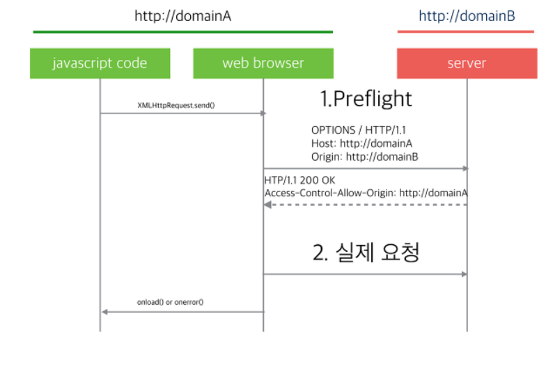

# CORS

CORS는 특정 헤더를 통해서 브라우저에게 **한 출처(origin)** 에서 실행되고 있는 웹 애플리케이션이 **다른 출처(cross-origin)** 에 원하는 리소스에 접근할 수 있는 권한이 있는지 없는지를 알려주는 정책.

- origin : 특정 페이지에 접근할 때 사용되는 URL의 Scheme,host,포트를 말한다. ⇒ 셋 중 하나만 다르면 cross-orgin
- 다 같으면 same-origin : 같은 주소일때에만 접근할 수 있다.
    - 보안이 좋다.

# 서버의 도움없이 동일 출처 정책을 회피하는 방법

1. 웹브라우저 실행 시 외부 요청을 허용하는 옵션을 사용
2. 외부 요청을 가능하게 해주는 플러그인 설치 : 확장프로그램 CORS
3. JSONP 방식으로 요청

# CORS 작동 방식

## Preflight request(사전 요청)

요청하려는 URL이 외부 도메인일 경우 웹브라우저는 preflight요청을 먼저 날림

요청은 실제로 요청하려는 경로와 같은 URL에 대해 OPTIONS 메서드로 요청을미리 날려 보고 요청을 할 수 있는 권한이 있는지 확인한다.

→ 서버측에서의 추가 처리 사항이 필요

# 서버에서 CORS 요청 핸들링

1. 모든 외부 도메인에서 모든 요청을 허용할 경우 처리
2. 외부 도메인 요청을 선별적으로 허용할 경우