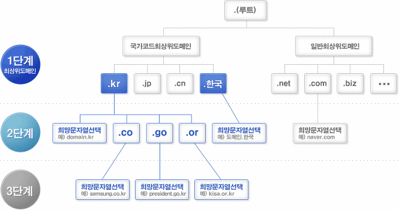

# DNS

DNS는 도메인네임서버를 일컫는다. 인터넷은 서버들을 유일하게 구분할 수 있는 IP주소를 기본체계로 이용하는데 숫자로 이루어진 조합이라 인간이 기억하기에는 무리가 따른다. 따라서 DNS를 이용해 IP주소를 인간이 기억하기 편한 언어체계로 변환하는 작업이 필요한데 이 역할을 DNS가 하는 것이다.

상위 DNS 부터 메시지를 주고 받아서 클라이언트가 요청한 도메인에 대한 IP 주소를 응답

## 구조

## DNS 서비스 유형

### 신뢰할 수 있는 DNS

- 개발자가 퍼블릭 DNS 이름을 관리하는 데 사용하는 업데이트 매커니즘을 제공하며 ,이를 통해 DNS 쿼리에 응답하여 도메인 이름을 IP 주소로 변환
- 신뢰할 수 있는 DNS는 도메인에 대해 최종 권한이 있으며 재귀적 DNS서버에 IP 주소 정보가 담긴 답을 제공할 책임이 있다.

### 재귀적 DNS

- 보통 클라이언트는 신뢰할 수 있는 DNS 서비스에 직접 쿼리를 수행하지 않고, 해석기 또는 재귀적 DNS 서비스라고 알려진 다른 유형의 DNS 서비스에 연결하는 경우가 일반적
- DNS 레코드를 소유하고 있지 않지만 사용자를 대신해서 DNS 정보를 가져올 수 있는 중간자 역할
- 일정 기간 동안 캐시된 또는 저장된 DNS 레퍼런스를 가지고 있는 경우, 소스 또는 IP 정보를 제공하여 DNS 쿼리에 답을 하거나, 해당 정보를 찾기 위해 쿼리를 하나 이상의 신뢰할 수 있는 DNS 서버에 전달

## 동작 과정

1. 웹브라우저에 www.naver.com을 입력하면 먼저 Local DNS에게 "www.naver.com" 이라는 hostname에 대한 ip주소를 질의하여 Local DNS에 없으면 다른 DNS name 서버 정보를 받음(Root DNS 정보 전달)
2. Root DNS 서버에 [www.naver.com](http://www.naver.com) 질의
3. Root DNS 서버로 부터 "com 도메인"을 관리하는 TLD 이름 서버 정보 전달 받음
4. TLD에 [www.naver.com](http://www.naver.com) 질의
5. TLD에서 [naver.com](http://naver.com) 관리하는 DNS 정보 전달
6. [naver.com](http://naver.com) 도메인을 관리하는 DNS 서버에 [www.naver.com](http://www.naver.com) 호스트네임에 대한 IP 주소 질의
7. Local DNS 서버에게 IP 주소는 ~~~~~ 응답
8. Local DNS 는 www.naver.com에 대한 IP 주소를 캐싱하고 IP 주소정보 전달

**Recursive Query**

: Local DNS 서버가 여러 DNS 서버를 차례대로 (Root DNS 서버 -> com DNS 서버 -> naver.com DNS 서버) 질의해서 답을 찾아가는 과정