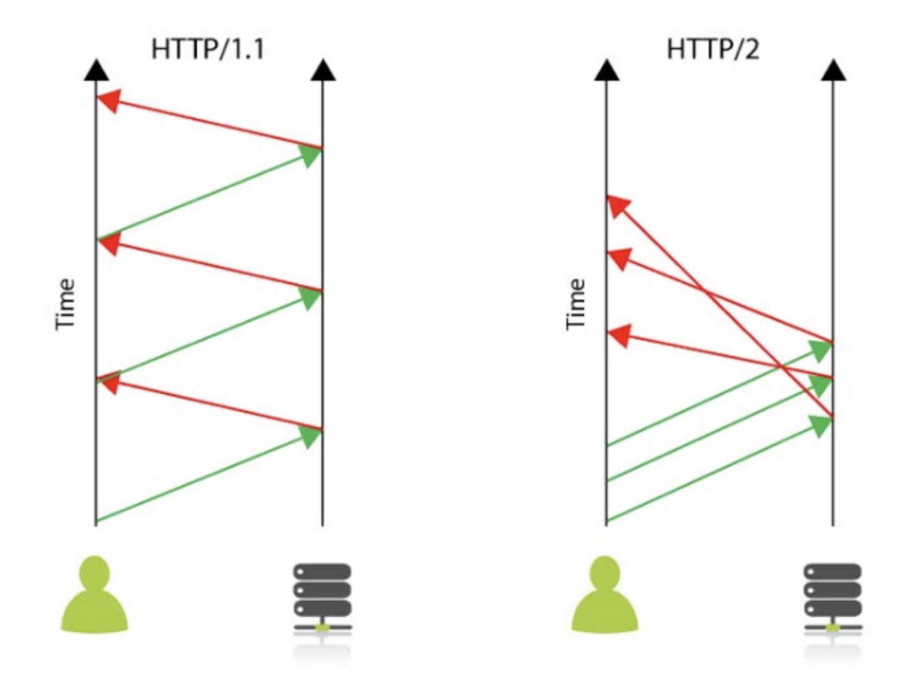

# HTTP 1.1 VS HTTP 2.0

## HTTP 1.1

- 기본적으로 Connection당 하나의 요청을 처리하도록 설계

→ 동시 전송 문제와 다수의 리소스를 처리하기에 속도와 성능 이슈를 가지고 있다.

### 문제점

1. HOL(Head Of Line) Blocking - 특정 응답 지연
    - 하나의 응답이 지연될 시 해당 응답이 완료될 때 까지 다음 요청은 **무한대기상태**가 된다.
2. RTT 증가
    - 하나의 Connection에 하나의 요청을 처리하므로, 요청별로 Connection을 만들게 된다.
    - 이로 인해, 3-way Handshake가 반복적으로 일어나게 되어 **불필요한 RTT 증가와 네트워크 지연을 초래**하는 것이다.
3. 혜비한 Header 구조
    - HTTP 1.1 헤더에는 많은 메타정보들이 저장되는데, 사용자가 방문한 웹페이지는 다수의 HTTP 요청이 발생하게 된다.
    - **이 경우 매 요청 시마다 중복된 헤더값을 전송하게 되고, 해당 도메인에 설정된 cookie 정보도 매 요청시 헤더에 포함**되므로 전송하려는 값보다 헤더 값이 더 클 수가 있다.

## HTTP 2.0

- 성능 뿐만 아니라 속도면에서 1.1보다 월등

### 특징

- Multiplexed Streams
    - **한 커넥션에 여러 개의 메시지를 동시에 주고 받을 수 있다.**
- Stream Prioritization
    - **요청 리소스간의 의존관계(우선순위)를 설정할 수 있다.**
    - 예를들어 클라이언트가 요청한 HTML 문서 안에 CSS 파일 1개와 Image 파일 2개가 존재하는데, 만약 Image 파일보다 CSS파일의 수신이 늦어지는 경우 브라우저 렌더링이 늦어질 수 있는데, 리소스간의 우선순위를 정함으로써 해결이 가능하다.
- Server Push
    - HTML 문서 상에 필요한 리소스를 클라이언트 요청없이 보낼 수 있다.
    - 클라이언트가 HTML 문서를 요청할 시 해당 HTML에 여러개의 리소스(CSS, Image 등)가 포함될 경우 **HTTP 1.1는 HTML문서를 해석하기 위해 필요한 리소스를 재 요청할 수 있는데, HTTP 2.0에서는 재 요청없이 Server Push 기법을 활용하여 해석이 가능하다.**
- Header Compression
    - Header 정보를 HPACK 압축방식을 이용하여 압축 후 전송한다.
    - 예를들어, 클라이언트가 두번의 요청을 보낸다고 가정하면 HTTP 1.1은 두개의 요청 Header를 중복값이 존재해도 그냥 중복 전송을 진행한다.
    - 하지만, **HTTP 2.0에서는 Header에 중복값이 존재하는 경우 static/Dynamic Header Table 개념을 사용하여 중복 Header를 검출하고 중복된 Header는 index값만 전송하고 중복되지 않은 정보 값은 Huffman Encoding 기법으로 인코딩하여 전송한다.**