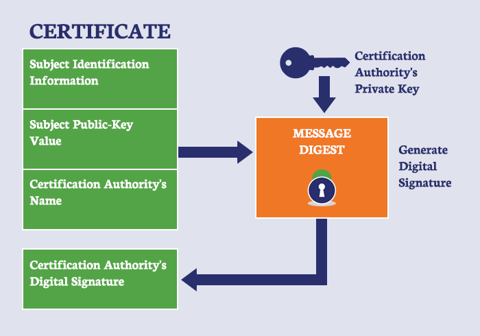

# HTTP

## HTTP

서버/ 클라이언트 모델을 따라 데이터를 주고 받기 위한 프로토콜

- 인터넷에서 하이퍼 텍스트를 교환하기 위한 통신 규약으로 80번 포트를 사용

### 구조

- 애플리케이션 레벨의 프로토콜로 TCP/IP 위에서 작동
- 상태를 가지고 있지 않는 Stateless 프로토콜
- 단점:

    암호화가 되지 않은 평문 데이터를 전송하는 프로토콜이였기 때문에, HTTP로 비밀번호나 주민등록번호 등을 주고 받으면 제3자가 정보를 조회할 수 있었다.

## HTTPS

HTTP에 데이터 암호화가 추가된 프로토콜

HTTPS는 HTTP와 다르게 443번 포트를 사용하며, 네트워크 상에서 중간에 제3자가 정보를 볼 수 없도록 공개키 암호화를 지원

### [공개키/개인키]

공개키/ 개인키 암호화 방식을 이용해 데이터를 암호하하고 있다. 공개키와 개인키는 서로를 위한 1쌍의 키이다.

- 공개키 : 모두에게 공개가능한 키
    - 공개키 암호화: 공개키로 암호화를 하면 개인키로만 복호화할 수 있다. -> 개인키는 나만 가지고 있으므로, 나만 볼 수 있다.
- 개인키 : 나만 가지고 알고 있어야 하는 키
    - 개인키 암호화: 개인키로 암호화하면 공개키로만 복호화할 수 있다. -> 공개키는 모두에게 공개되어 있으므로, 내가 인증한 정보임을 알려 신뢰성을 보장할 수 있다.

### 동작과정

SSL과 같은 프로토콜을 사용하여 공개키/개인키 기반으로 데이터를 암호화하고 있다.

데이터는 암호화되어 전송되기 때문에 임의의 사용자가 데이터를 조회하여도 원본의 데이터를 보는 것은 불가능하다.

⇒ 서버는 클라이언트가 요청을 보낼 때 암호화를 하기 위한 공개키를 생성해야 하는 데, 일반적으로 인증된 기간(Certificate Authority)에 공개키를 전송하여 인증서를 발급 

1. A기업은 HTTP 기반의 애플리케이션에 HTTPS를 적용하기 위해 공개키/개인키를 발급함
2. CA 기업에게 돈을 지불하고, 공개키를 저장하는 인증서의 발급을 요청함
3. CA 기업은 CA기업의 이름, 서버의 공개키, 서버의 정보 등을 기반으로 인증서를 생성하고, CA 기업의 개인키로 암호화하여 A기업에게 이를 제공함
4. A기업은 클라이언트에게 암호화된 인증서를 제공함
5. 브라우저는 CA기업의 공개키를 미리 다운받아 갖고 있어, 암호화된 인증서를 복호화함
6. 암호화된 인증서를 복호화하여 얻은 A기업의 공개키로 데이터를 암호화하여 요청을 전송함
7. 

    

호화된 인증서는 CA의 개인키로 암호화되었기 때문에, 신뢰성을 확보할 수 있고, 클라이언트는 A 기업의 공개키로 데이터를 암호화하였기 때문에 A기업만 복호화하여 원본의 데이터를 얻을 수 있다.

HTTPS는 이러한 공개키/개인키 기반의 대칭키 암호화 방식을 활용하여 안전성을 확보하고 있다

## 정리

- HTTP는 암호화가 추가되지 않았기 때문에 보안에 취약한 반면, HTTPS는 안전하게 데이터를 주고받을 수 있다.
- 개인 정보와 같은 민감한 데이터를 주고 받아야 한다면 HTTPS를 이용해야 하지만, 단순한 정보 조회 등만을 처리하고 있다면 HTTP를 이용하면 된다.

- HTTP vs HTTPS
- HTTP 요청/응답 헤더 [https://goddaehee.tistory.com/169](https://goddaehee.tistory.com/169)
- GET, POST 비교