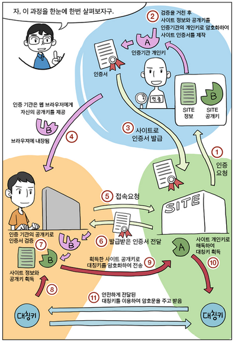

# SSL 인증서

## SSL를 이용하여 보안 통신을 진행하는 과정

1. 사이트는 인증기관에 자신의 정보와 공개키를 제출
2. 인증기관은 정보를 면밀히 검토한 뒤, 사이트의 정보와 공개키를 자신의 비밀키로 암호화
3. 인증기관은 인증기관의 비밀키로 암호화된 사이트의 정보와 공개키를 사이트에 송신
4. 개인이 브라우저를 통해 사이트에 접속하면, 암호화된 사이트의 정보와 공개키를 사이트로부터 받는다.
5. 브라우저는 인증기관의 공개키로 이를 복호화하여 사이트의 공개키를 얻는다
6. 브라우저가 대칭키를 사이트의 공개키로 암호화하여 사이트에 보낸다
7. 사이트는 자신의 개인키로 암호화된 대칭키를 복호화한다
8. 이제 개인과 사이트는 대칭키로 통신할 수 있다.