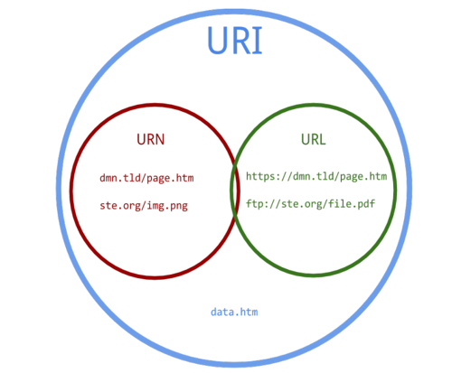

# URL VS URI VS URN

## URI

Uniform Resource Identifier의 약자,통합 자원 식별자

인터넷의 우편물 주소 같은 것으로, 자원을 고유하게 식별하고 위치를 지정

URI의 존재는 인터넷에서 요구되는 기본 조건으로서 인터넷 프로토콜에 항상 붙어 다님

## URL

URL은 Uniform Resource Locator의 약자, 통합 자원 지시자

URI의 가장 흔한 형태로 네트워크 상에서 자원이 어디 있는지에 대한 구체적인 위치를 나타냄

요즘에는 Apache나 Nginx 등이 rewrite기술로 인해 URL을 단순히 자원 지시자로서 특정 파일의 위치를 지시하기 보다 자원 식별자로서 사용이 되고 있습니다.

오늘날 **대부분의 URI는 URL**입니다.

## URN

Uniform Resource Name의 약자 , 통합 자원 이름

리소스의 위치에 영향 받지 않는 유일무이한 이름 역할

위치독립적이기 때문에 리소스를 여기저기로 옮기더라도 문제없이 동작하며 여러 종류의 네트워크 접속 프로토콜로 접근해도 문제가 없음

`실험 중인 상태고 아직 널리 채택되지 않음`