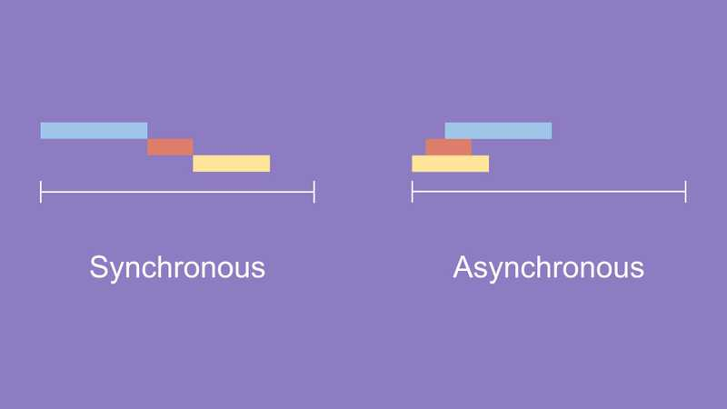

# 동기/비동기

## 데이터 처리 방식

동기와 비동기로 작성한 코드의 가장 큰 차이 중 하나는 **런타임시에 발생하는 지연시간**

## 동기

데이터의 요청과 결과가 한 자리에서 동시에 일어난다. 즉 사용자가 데이터를 서버에게 요청한다면 그 서버가 데이터 요청에 따른 응답을 사용자에게 다시 리턴해주기 전까지 사용자는 다른 활동을 할 수 없으며 기다려야 한다.

ex) ATM 기계, 키오스크

### 장점

1. 코드 파악이 쉽고
2.  유지보수
3. 디버깅이 쉽다
4. 설계가 매우 간단하고 직관적이다

### 단점

계속 기다리면서 다른 작업을 할 수 있는 시간이 낭비

 

## 비동기

요청을 보냈을 때 응답 상태와 상관없이 다른 외부 활동을 수행하여도 되고, 서버에게 다른 요청사항을 보내도 상관X

### 장점

요청에 따른 결과가 반환되는 시간 동안 다른 작업을 수행

### 단점

지속적으로 응답할 수 있게 해주지만, 동기적 방식에 비해 많은 비용이 발생