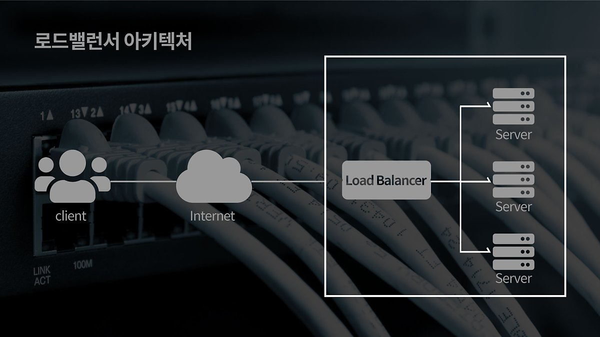
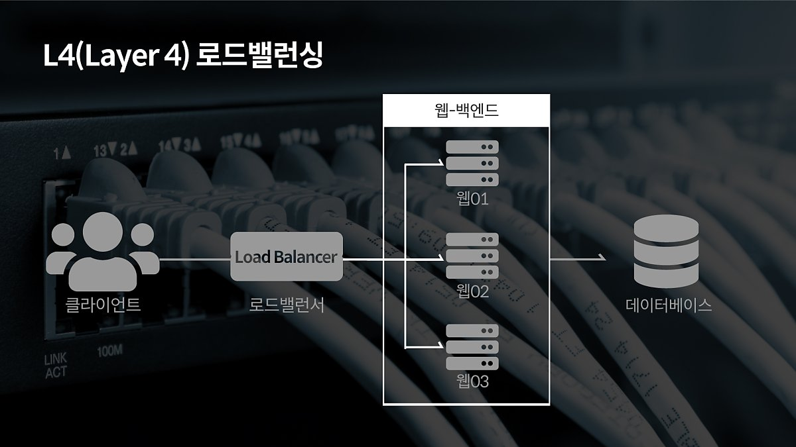
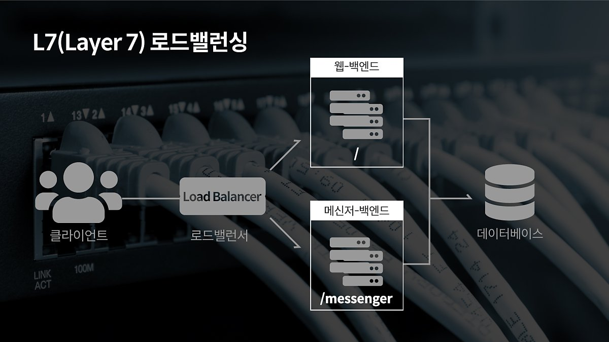

# 로드밸런서

[https://m.post.naver.com/viewer/postView.nhn?volumeNo=27046347&memberNo=2521903](https://m.post.naver.com/viewer/postView.nhn?volumeNo=27046347&memberNo=2521903)

> 서버에 가해지는 부하(=로드)를 분산(=밸런싱)해주는 장치 또는 기술을 통칭합니다.

클라이언트와 서버풀 사이에 위치하며, 한대의 서버로 부하가 집중되지 않도록 트래픽을 관리해 각각의 서버가 최적의 퍼포먼스를 보일 수 있도록 합니다.

---

로드밸런싱은 여러 대의 서버를 두고 서비스를 제공하는 분산 처리 시스템에서 필요한 기술입니다.

서비스의 제공 초기 단계라면 적은 수의 클라이언트로 인해 서버 한 대로 요청에 응답하는 것이 가능합니다. 하지만 사업의 규모가 확장되고, 클라이언트의 수가 늘어나게 되면 기존 서버만으로는 정상적인 서비스가 불가능하게 됩니다. 이처럼 증가한 트래픽에 대처할 수 있는 방법은 크게 두 가지입니다.

## Scale-up, Scale-out

- Scale-up : 서버 자체의 성능을 확장하는 것

ex) CPU가 i3인 컴퓨터를 i7으로 업그레이드

- Scale-out : 기존 서버와 동일하거나 낮은 성능의 서버를 두대 이상 증설하여 운영하는 것을 의미

ex) CPU가 i3인 컴퓨터를 여러 대 추가 구입해 운영하는 것

→ 서버를 증설하기로 했다면 여러 대의 서버로 트래픽을 균등하게 분산해주는 로드밸런싱이 필요

## 로드밸런싱 알고리즘

- 라운드 로빈 방식
    - 서버에 들어온 요청을 순서대로 돌아가며 배정하는 방식입니다.
- 가중 라운드 로빈 방식
    - 각각의 서버마다 가중치를 매기고 가중치가 높은 서버에 클라이언트 요청을 우선적으로 배분합니다.
- IP 해시 방식
    - 클라이언트의 IP 주소를 특정 서버로 매핑하여 요청을 처리하는 방식입니다.
- 최소 연결 방식
    - 요청이 들어온 시점에 가장 적은 연결상태를 보이는 서버에 우선적으로 트래픽을 배분합니다.
- 최소 리스폰 타임
    - 서버의 현재 연결 상태와 응답시간(Response Time, 서버에 요청을 보내고 최초 응답을 받을 때까지 소요되는 시간)을 모두 고려하여 트래픽을 배분합니다

## L4 로드 밸런싱

네트워크 계층(IP, IPX)이나 트랜스포트 계층(TCP, UDP)의 정보를 바탕으로 로드를 분산합니다. IP주소나 포트번호, MAC주소, 전송 프로토콜에 따라 트래픽을 나누는 것이 가능합니다.

## L7 로드 밸런싱

L7 로드밸런서의 경우 애플리케이션 계층(HTTP, FTP, SMTP)에서 로드를 분산하기 때문에 HTTP 헤더, 쿠키 등과 같은 사용자의 요청을 기준으로 특정 서버에 트래픽을 분산하는 것이 가능합니다.

### 비교

