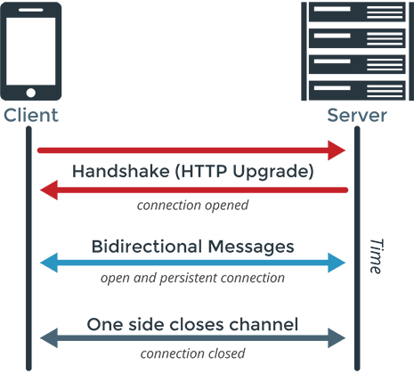

# Rest vs WebSocket

# Rest와 WebSocket의 차이

- **접속을 유지하는 지의 여부**

# Rest

## AJAX

- AJAX는 Javascript의 XmlHttpRequest 객체를 기반으로 한다. **비동기 Javascript 및 XML의 축약 된 양식**이다 . XmlHttpRequest 객체를 사용하면 전체 웹 페이지를 다시 로드하지 않고도 Javascript를 실행할 수 있다. AJAX는 웹 페이지의 일부만 송수신
- **서버가 요청없는 클라이언트에게 먼저 통신을 할수 있는 방법이 없음**. 반이중 통신

# WebSocket

- 순수 웹 환경에서 실시간(양방향) 통신을 위한 스펙
- 서버와 클라이언트가 지속적으로 연결된 TCP라인을 통해 실시간으로 데이터를 주고받을 수 있도록 HTML5의 새로운 사양
- 일반적인 TCP소켓과 같이 연결지향 양방향 전이중 통신이 가능하다.
- 채팅,게임,실시간 주식차트와 같은 실시간이 요구되는 응용프로그램 개발에 사용가능
- 클라이언트와 서버간에 전이중 통신을 수행하러면 클라이언트가 서버로HTTP UPGRADE 요청을 보내야 한다. 이를 웹 소켓 프로토콜 핸드 쉐이크라고한다.