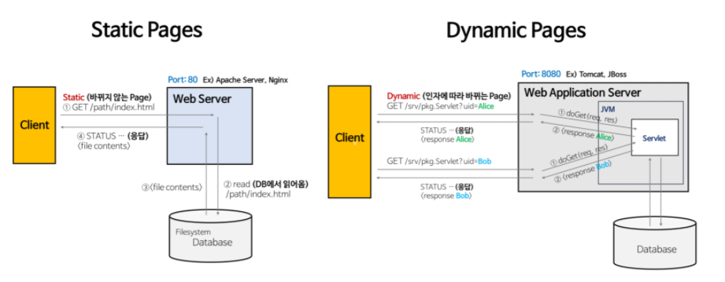

# web server vs was

# static page &  dynmic page

1. static page : 항상 동일한 페이지를 반환한다.
2. Dynamic page: 
    1. 인자의 내용에 맞게 동적인 페이지를 반환한다.
    2. 웹 서버에 의해서 실행되는 프로그램을 통해서 만들어진 결과물 * Servlet: WAS 위에서 돌아가는 Java Program

# Web Server vs WAS

## Web Server

- 하드웨어와 소프트웨어로 구분된다.
    - 하드웨어 : web 서버가 설치되어 있는 컴퓨터
    - 소프트웨어 : 웹 브라우저 클라이언트로부터 HTTP 요청을 받아 정적인 컨텐츠를 제공하는 컴퓨터 프로그램
        - 정적인 컨텐츠 : html, jpeg, css 등
- 기능
    - http 프로토콜을 기반으로 하여 웹 브라우저의 요청을 서비스 하는 기능
    - 정적인 컨텐츠 제공 / was를 거치지 않고 바로 자원을 제공
    - 동적인 컨텐츠 제공을 위한 요청 전달 / 클라이언트의 요청을 was에 보내고 was의 응답을 클라이언트에게 전달
- ex) apache server, nginx, LLS

## WAS(Web Application Server)

`Web Server + Web Container`

### 개념

- DB조회나 다양한 로직 처리를 요구하는 동적인 컨텐츠를 제공하기 위함
- HTTP를 통해 컴퓨터나 장치에 애플리케이션을 수행하는 미들웨어
- 웹 컨테이너, 서블릿 컨테이너 라고도 불린다.
- 분산 트랜젝션, 보안, 쓰레드 처리 등의 기능을 처리하는 분산 환경에서 사용

## 예

- Tomcat, JBoss, Jeus

# 구분하는 이유

- Web Server
    - Web Server를 통해 정적인 파일들을 application server까지 가지 않고 앞단에서 빠르게 보냄 → 정적 컨텐츠만 처리하도록 기능을 분배하여 서버의 부담을 줄인다.
- WAS
    - 사용자의 요청에 맞게 적절한 동적 컨텐츠를 제공해야 된다.
    - was를 통해 요청에 맞는 데이터를 DB에서 가져와서 로직에 맞게 그때그때 결과를 만들어서 제공함으로써 자원을 효율적으로 사용할 수 있다.

# 정리

1. 기능을 분리하여 서버 부화 방지
    1. was는 DB조회 로직처리 등 
    2. 단순한 정적 컨텐츠는 web Server에서 
2. 보안 강화
3. 여러대의 was를 연결 가능
4. 하나의 서버에 여러 웹 애플리케이션 사용 가능