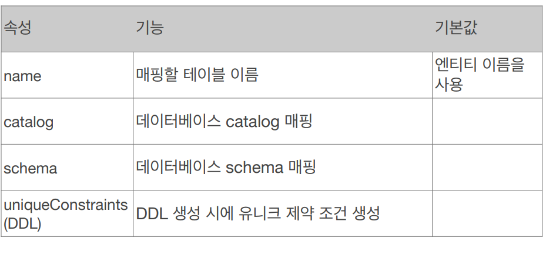

# Entitymapping

# 엔티티 매핑

- 객체와 테이블 매핑 : @Entity, @Table
- 필드와 컬럼 매핑 : @Column
- 기본 키 매핑 : @ID
- 연관 관계 매핑 : @ManyToOne,@JoinColumn

---

# 객체와 테이블 매핑

## @Entity

- JPA가 관리, 엔티티
- JPA를 사용해서 테이블과 매핑할 클래스는 @Entity 필수

### 주의

- 기본 생성자 필수
- final ,enum,interface,inner 사용X
- 저장할 필드에 final 사용X

### 속성:name

- JPA에서 사용할 엔티티 이름을 지정
- 기본 값: 클래스 이름을 그래도 사용(ex: Member)
- 같은 클래스 이름이 없으면 가급적 기본 값사용

## @Table

- 엔티티와 매핑할 테이블 지정



```java
@Entity
@Table(name = "Member")
public class Member {
    @Id
    private  Long id;
    private  String name;

    public Member(){}

    public Member(Long id, String name) {
        this.id = id;
        this.name = name;
    }

    public Long getId() {
        return id;
    }

    public void setId(Long id) {
        this.id = id;
    }

    public String getName() {
        return name;
    }

    public void setName(String name) {
        this.name = name;
    }
}
```

# 데이터베이스 스키마 자동 생성

- DDL을 애플리케이션 실행 시점에 자동 생성
- 테이블 중심 → 객체 중심
- 데이터베이스 방언을 활용해서 데이터베이스에 맞는 적절한 DDL 생성
- 개발장비에서만 사용
- 생성된 DDL은 운영서버에서 X 다듬은 후 사용

[속성 - hibernate.hbm2ddl.auto](https://www.notion.so/5db74fc1dec94ac6982c49f85ea437aa)


`<property name="hibernate.hbm2ddl.auto" value="create" />` xml에 적어서 사용 가능

## 주의

- 운영 장비에는 절대 create, create-drop, update 사용 X
- 개발 초기 create or update
- 테스트 서버 update or validate
- 스테이징과 운영서버 validate or none

## DDL 생성 기능

- 제약 조건 추가 : 회원 이름은 필수 ,10자 초과 X
    - `@Column(nullable=false,length=10)`
- DDL 생성 기능은 DDL을 자동 생성할 때만 사용하고 실행 로직에는 영향 X

# 필드와 컬럼 매핑

```java
@Entity 
public class Member { 
 @Id 
 private Long id; 
 @Column(name = "name") 
 private String username; 
 private Integer age; 
 @Enumerated(EnumType.STRING) 
 private RoleType roleType; 
 @Temporal(TemporalType.TIMESTAMP) 
 private Date createdDate; 
 @Temporal(TemporalType.TIMESTAMP) 
 private Date lastModifiedDate; 
 @Lob 
 private String description; 
 //Getter, Setter… 
}
```

## @Column

- (uniqe 는 이름이 랜덤성으로 생성되어서 잘 사용X)
- 컬럼 매핑

[제목 없음](https://www.notion.so/48c3058c17ed4239a99cd4388ed29bed)

## @Enumerated

- 자바 enum 타입을 매핑할 때 사용
- ORDINAL 사용 X
- `EnumType.ORDINAL`: enum 순서를 데이터베이스에 저장
- `EnumType.STRING`: enum 이름을 데이터베이스에 저장

## @ Temporal

- 날짜 타입 Date,Calendar 을 매핑할 때 사용
- 참고: LocalDate, LocalDateTime을 사용할 때는 생략 가능(최신 하이버네이트 지원)
- TemporalType.DATE: 날짜, 데이터베이스 date 타입과 매핑
(예: 2013–10–11)
- TemporalType.TIME: 시간, 데이터베이스 time 타입과 매핑
(예: 11:11:11)
- TemporalType.TIMESTAMP: 날짜와 시간, 데이터베이스
timestamp 타입과 매핑(예: 2013–10–11 11:11:11)

## @Lob

- 데이터베이스 BLOB,CLOB 타입과 매핑
- 지정할 수 있는 속성이 없다.

## @Transient

- 필드 매핑 X
- 데이터베이스에 저장 X 조회 X
- 주로 메모리상에서만 임시로 어떤 값을 보관하고 싶을 때 사용

---

# 기본 키 매핑

## 기본 키 매핑 어노테이션

- @Id
- @GeneratedValue

```java
@Id @GeneratedValue(strategy = GenerationType.AUTO)
private Long id;
```

## 기본 키 매핑 방법

- 직접 할당 :@ID 사용
- 자동생성 `@GeneratedValue`
    - IDENTITY: 데이터베이스에 위임, MYSQL
    - SEQUENCE: 데이터베이스 시퀀스 오브젝트 사용, ORACLE
        - @SequenceGenerator 필요
    - TABLE: 키 생성용 테이블 사용, 모든 DB에서 사용
    - AUTO: 방언에 따라 자동 지정, 기본값

### IDENTITY

- 기본 키 생성을 데이터베이스에 위임
- JPA는 보통 트랜잭션 커밋 시점에 Insert SQL 실행
- AUTO_ INCREMENT는 데이터베이스에 INSERT SQL을 실행
한 이후에 ID 값을 알 수 있음
- IDENTITY 전략은 em.persist() 시점에 즉시 INSERT SQL 실행
하고 DB에서 식별자를 조회

```java
@Entity 
public class Member { 
 @Id 
 @GeneratedValue(strategy = GenerationType.IDENTITY) 
 private Long id;
```


- insert 시에는 null이지만 DB에서 알아서 숫자 넣어줌


### SEQUENCE 전략

- 데이터베이스 시퀀스는 유일한 값을 순서대로 생성하는 특별한 데이터베이스 오브젝트
- 테이블과 별개로 생성된다

```java
@Entity 
@SequenceGenerator( 
 name = “MEMBER_SEQ_GENERATOR", 
 sequenceName = “MEMBER_SEQ", //매핑할 데이터베이스 시퀀스 이름
 initialValue = 1, allocationSize = 1) 
public class Member { 
 @Id 
 @GeneratedValue(strategy = GenerationType.SEQUENCE, 
 generator = "MEMBER_SEQ_GENERATOR") 
 private Long id;

```

- SequenceGenerator


### TABLE 전략

- 키 생성 전용 테이블을 하나 만들어서 데이터베이스 시퀀스를 흉내내는 전략
- 장점 : 모든 데이터 베이스에 적용 가능
- 단점 : 성능
- 별로 권장하지 않는 전략

```java
@Entity 
@TableGenerator( 
 name = "MEMBER_SEQ_GENERATOR", 
 table = "MY_SEQUENCES", 
 pkColumnValue = “MEMBER_SEQ", allocationSize = 1) 
public class Member { 
 @Id 
 @GeneratedValue(strategy = GenerationType.TABLE, 
 generator = "MEMBER_SEQ_GENERATOR") 
 pri
```

- TableGenerator


---
