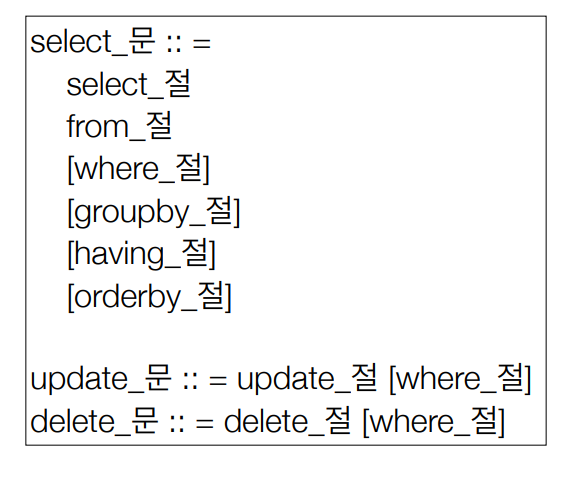

# 객체지향쿼리

# 객체지향 쿼리 언어

## 🥟JPQL

- JPA를 사용하면 엔티티 객체를 중심으로 개발
- 검색 쿼리가 문제..
- SQL을 추상화한 객체지향 쿼리 언어 제공
- SQL은 데이터베이스 테이블을 대상으로 쿼리
- JPQL은 엔티티 객체를 대상으로 쿼리

```java
//엔티티를 중심으로 실행 m== 엔티티 자체를 조회해라!! , 동적쿼리를 짜기에는 불편하다
//Mybatis는 동적쿼리가 대체적으로 편하다.
List<Member> result=em.createQuery("select m from Member m where m.username like '%kim%'",Member.class)
        .getResultList();
```

## 💨JPA Criteria

```java
//Criteria 사용 준비 알아보기가 힘들다... 동적쿼리는 사용하기는 편하다..
CriteriaBuilder cb = em.getCriteriaBuilder();
CriteriaQuery<Member> query = cb.createQuery(Member.class);
//루트 클래스 (조회를 시작할 클래스)
Root<Member> m = query.from(Member.class);
//쿼리 생성
CriteriaQuery<Member> cq = query.select(m).where(cb.equal(m.get("username"), “kim”));
List<Member> resultList = em.createQuery(cq).getResultList();
```

- 단점 : 너무 복잡하고 실용성이 없다
- 문자가 아닌 자바코드로 JPQL 작성

## QueryDSL

- 문자가 아닌 자바코드로 JPQL 작성
- 컴파일 시점에 문법 오류를 찾을 수 있음
- 동적쿼리 작성 편리함
- 단순하고 쉬움

```java
//JPQL 
//select m from Member m where m.age > 18
JPAFactoryQuery query = new JPAQueryFactory(em);
QMember m = QMember.member; 

List<Member> list = 
query.selectFrom(m)
.where(m.age.gt(18)) 
.orderBy(m.name.desc())
.fetch();
```

## 네이티브 SQL

- JPA가 제공하는 SQL을 직접 사용
- JPQL로 해결할 수 없는 특정 데이터베이스에 의존적인 기능

```java
String sql = 
 “SELECT ID, AGE, TEAM_ID, NAME FROM MEMBER WHERE NAME = ‘kim’"; 
List<Member> resultList = 
 em.createNativeQuery(sql, Member.class).getResultList();
```

## JDBC API 직접사용

- JPA를 사용하면서 JDBC 커넥션을 직접 사용하거나, 스프링
JdbcTemplate, 마이바티스등을 함께 사용 가능
- 영속성 컨텍스트를 적절한 시점에 강제로 플러시 필요

# JPQL

## 문법



- 엔티티와 속성은 대소문자 구분 O
- JPQL 키워드는 대소문자 구분 X(SELECT, from, where)
- 엔티티 이름 사용
- 별칭은 필수

## TypeQuery,Query

- TypeQuery : 반환 타입이 명확할 때 사용
- Query: 반환 타입이 명확하지 않을 때 사용
- 

```java
//반환 타입이 명확할 때
TypedQuery<Member> query = em.createQuery("select m from Member m", Member.class);
//리턴 타입이 명확하지 않을 때
Query query2 = em.createQuery("select m.age, m.username from Member m");
```

## 결과 조회 API

- `query.getResultList()` : 결과가 하나 이상일 때 리스트 반환
- `query.getSingleResult()` : 결과가 정확히 하나, 단일 객체 반환

## 파라미터 바인딩

- 이름 기준

```java
SELECT m FROM Member m where m.username=:username 
query.setParameter("username", usernameParam);
```

- 위치 기준

```java
SELECT m FROM Member m where m.username=?1 
query.setParameter(1, usernameParam);
```

- 위치보다 이름으로 자주 사용한다.

## 프로젝션

- select 절에 조회할 대상을 지정하는 것
- 프로젝션 대상 : 엔티티, 임베디드 타입, 스칼라 타입(기본 데이터 타입)
- DISTINCT 로 중복 제거

### 여러 값 조회

- select m.username, m.age from Member m

1. Query 타입
2. Object[] 타입
3. new 명령어로 조회
    - DTO로 바로 조회
    - 패키지명을 포함한 전체 클래스 명 입력
    - 순서와 타입이 일치하는 생성자 필요

## 페이징 API

- `setFirstResult ()` : 조회 시작 위치
- `setMaxResults()` : 조회할 데이터 수

```java
//페이징 쿼리
 String jpql = "select m from Member m order by m.name desc";
 List<Member> resultList = em.createQuery(jpql, Member.class)
 .setFirstResult(10)
 .setMaxResults
 .getResultList();
```

## 서브 쿼리

- JPA는 where, having 절에서만 서브 쿼리 사용 가능
- select 절도 가능
- from 절에서는 불가능

## 기본 함수

- CONCAT
- SUBSTRING
- RIM
- LOWER, UPPER
- LENGTH
- LOCATE
- ABS, SQRT, MOD
- SIZE, INDEX(JPA 용도)
