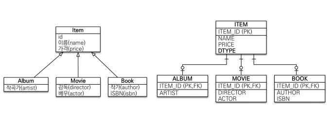

# 고급 매핑

# 상속관계 매핑

- 관계형 데이터베이스는 상속 관계 X
- 슈퍼타입 서브 타입 관계라는 모델링 기법이 객체 상속과 유사
- 상속관계 매핑 : 객체의 상속과 구조 DB의 슈퍼타입 서브타입 관계를 매핑

# 슈퍼타입 서브타입 논리모델 전략

- 각각 테이블로 변환 → 조인 전략
- 통합 테이블로 변환 → 단일 테이블 전략
- 서브 타입 테이블로 변환 → 구현 클래스마다 테이블 전략

# 주요 어노테이션

- `@Inheritance([strategy=InheritanceType.XXX](http://strategy%3Dinheritancetype.xxx/))`
    - JOINED : 조인 전략
    - SINGLE_TABLE : 단일 테이블 전략
    - TABLE_PER_CLASS : 구현 클래스마다 테이블 전략
- `@DiscriminatorColumn(name=“DTYPE”)` //조인된 테이블 명을 넣어준다.
- `@DiscriminatorValue(“XXX”)`

## 조인 전략



- @Inheritance 사용 X

```
Hibernate: 
    
    create table Item (
       DTYPE varchar(31) not null,
        id bigint not null,
        name varchar(255),
        price integer not null,
        artist varchar(255),
        author varchar(255),
        isbn varchar(255),
        actor varchar(255),
        director varchar(255),
        primary key (id)
    )
```

- 조인 전략 사용

```
ibernate: 
    
    create table Album (
       artist varchar(255),
        id bigint not null,
        primary key (id)
    )
Hibernate: 
    
    create table Book (
       author varchar(255),
        isbn varchar(255),
        id bigint not null,
        primary key (id)
    )
Hibernate: 
    
    create table Item (
			DTYPE varchar(31) not null,//조인된 테이블명을 DB에 저장 운영상 이점이 많음
       id bigint not null,
        name varchar(255),
        price integer not null,
        primary key (id)
    )
```

## 장 단점

- 장점
    - 테이블 정규화
    - 외래 키 참조 무결성 제약조건 활용가능
    - 저장공간 효율화
- 단점
    - 조회시 조인을 많이 사용, 성능 저하
    - 조회 쿼리가 복잡함
    - 데이터 저장시 INSERT SQL 2번 호출

## 단일 테이블 전략


## 장 단점

- 장점
    - 조인이 필요 없으므로 일반적으로 조회 성능이 빠름
    - 조회 쿼리가 단순함
- 단점
    - 자식 엔티티가 매핑한 컬럼은 모두 NULL 허용
    - 단일 테이블에 모든 것을 저장하므로 테이블이 커질 수 있다. 상
    황에 따라서 조회 성능이 오히려 느려질 수 있다

## 구현 클래스마다 테이블 전략


```java
public abstract class Item {

    @Id @GeneratedValue
    private Long id;

    private String name;
    private int price;

    public Long getId() {
        return id;
    }

    public void setId(Long id) {
        this.id = id;
    }

    public String getName() {
        return name;
    }

    public void setName(String name) {
        this.name = name;
    }

    public int getPrice() {
        return price;
    }

    public void setPrice(int price) {
        this.price = price;
    }
}
```

- 추상화 클래스로 만들어서 사용
- DB에 테이블로 생성되지 않는다.
- 추천되지 않는 전략임

## 장 단점

- 장점
    - 서브 타입을 명확하게 구분해서 처리할 때 효과적
    - not null 제약조건 사용 가능
- 단점
    - 여러 자식 테이블을 함께 조회할 때 성능이 느림
    - 자식 테이블을 통합해서 쿼리하기 어려움

# @MappedSuperclass


- 상속관계 매핑X
- 엔티티X, 테이블과 매핑X
- 부모 클래스를 상속 받는 자식 클래스에 매핑 정보만 제공
- 조회, 검색 불가(em.find(BaseEntity) 불가)
- 직접 생성해서 사용할 일이 없으므로 추상 클래스 권장

- 테이블과 관계 없고, 단순히 엔티티가 공통으로 사용하는 매핑
정보를 모으는 역할
- 주로 등록일, 수정일, 등록자, 수정자 같은 전체 엔티티에서 공통
으로 적용하는 정보를 모을 때 사용
- 참고: @Entity 클래스는 엔티티나 @MappedSuperclass로 지
정한 클래스만 상속 가능
