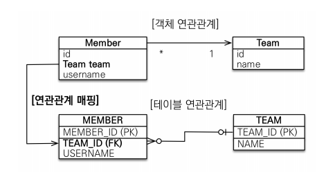

# 다양한 연관관계 매핑

# 매핑시 고려사항 3가지

- 다중성
- 단방향, 양방향
- 연관관계의 주인

## 다중성

- 다대일 : @ManyToOne
- 일대다: @OneToMany
- 일대일:@OneToOne
- 다대다 : @ManyToMany

## 단방향, 양방향

- 테이블
    - 외래 키 하나로 양쪽 조인 가능
    - 사실 방향이라는 개념이 없다.
- 객체
    - 참조용 필드가 있는 쪽으로만 참조 가능
    - 한쪽만 참조하면 단방향
    - 양쪽이 서로 참조하면 양방향

## 연관관계의 주인

- 테이블은 외래 키 하나로 두 테이블이 연관관계를 맺음
- 외래키를 관리하는 참조
- 주인의 반대편 : 외래 키에 영향을 주지 않ㅇ음, 단순 조회만 가능

# 다대일

## 단방향



- 가장 많이 사용하는 연관 관계
- 다대일의 반대는 일대다

```java
		//Member.class
		@Id
    @GeneratedValue
    @Column(name="MEMBER_ID")
    private Long id;
    @Column(name = "USERNAME")
    private String username;

    @ManyToOne //단방향
    @JoinColumn(name="TEAM_ID")
    private Team team;
```

## 양방향


- 외래 키가 있는 쪽이 연관관계의 주인
- 양쪽을 서로 참조하도록 개발

```java
		//Team.class
		@Id @GeneratedValue
    @Column(name="TEAM_ID")
    private Long id;
    private String name;

    @OneToMany(mappedBy = "team")//양방향 설정
    List<Member> members = new ArrayList<Member>();
```

# 일대다

- **실무에서는 권장하지 않는다. 그냥 있다는 걸로만 알고 다대일로 사용!!**

## 단방향


- 일(1)이 연관관계의 주인
- 일대 다 관계는 항상 다쪽에 외래키가 있음
- 객체와 테이블의 차이 때문에 반대편 테이블의 외래 키를 관리하
는 특이한 구조
- @JoinColumn을 꼭 사용해야 함. 그렇지 않으면 조인 테이블
방식을 사용함(중간에 테이블을 하나 추가함)

```
Hibernate: 
    
    create table Member (
       MEMBER_ID bigint not null,
        USERNAME varchar(255),
        team_TEAM_ID bigint,
        primary key (MEMBER_ID)
    )
Hibernate: 
    
    create table Team (
       TEAM_ID bigint not null,
        name varchar(255),
        primary key (TEAM_ID)
    )
Hibernate: 
    //중간에 테이블이 추가됨
    create table Team_Member (
       Team_TEAM_ID bigint not null,
        members_MEMBER_ID bigint not null
    )
```


### 단점

- 연관관계 관리를 위해 추가로 UPDATE SQL 실행
- 엔티티가 관리하는 외래 키가 다른 테이블에 있음
- **일대다 단방향 매핑보다는 다대일 양방향 매핑을 사용하자**

## 양방향


- 공식적으로 존재 X
- 야매로 만드는 것!
- `@JoinColumn(insertable=false, updatable=false)`
- **다대일 양방향을 사용하자**

# 일대일

- 주 테이블에 외래 키
- 대상 테이블에 외래 키

## 단방향


- 다대일 단방향 매핑과 유사

## 양방향


- 외래 키가 있는 곳이 연관관계의 주인
- 반대편은 mappedBy 적용
- 장점: 주 테이블만 조회해도 대상 테이블에 데이터가 있는지 확인 가능
- 단점: 값이 없으면 외래 키에 null 허용

## 대상 테이블에 외래 키 단방향


- JPA 지원 X
- 양방향 관계는 지원
- 장점: 주 테이블과 대상 테이블을 일대일에서 일대다 관계로 변경할 때 테이블 구조 유지
- 단점: 프록시 기능의 한계로 지연 로딩으로 설정해도 항상 즉시 로딩됨(프록시는 뒤에서 설명

# 다대다

- 절대 실무에서는 사용하지 않는다
- 그냥 알고만 있으면 됨
- @JoinTable로 연결 테이블 지정
- @ManyToMany
