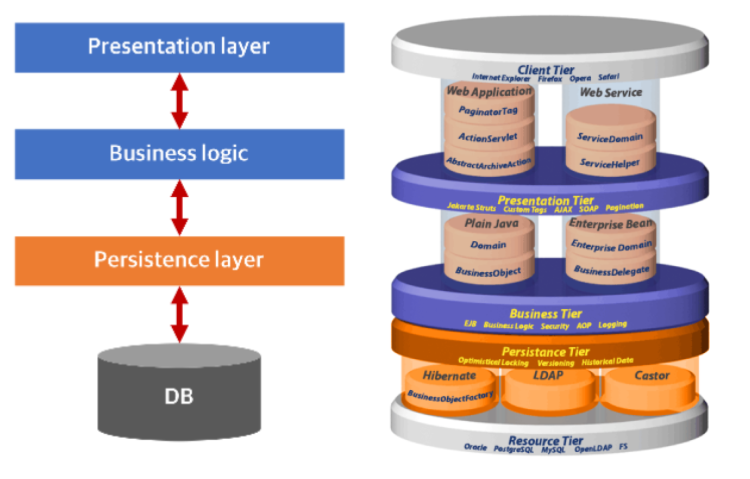
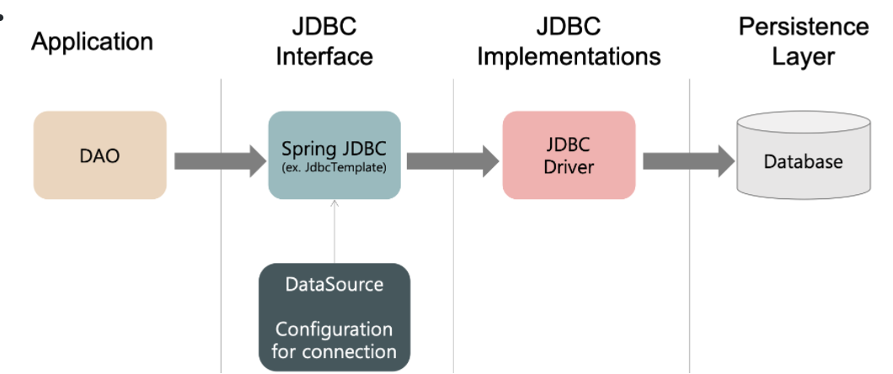
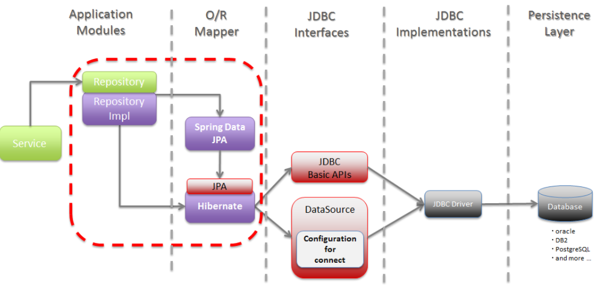
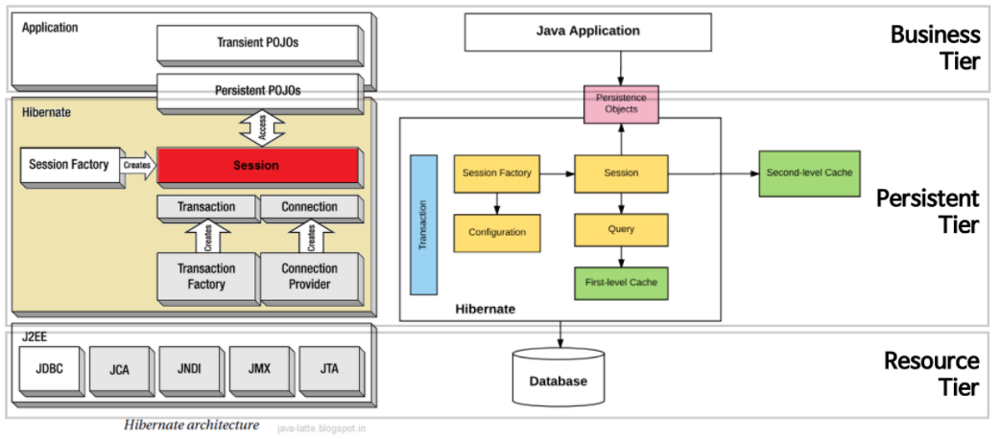
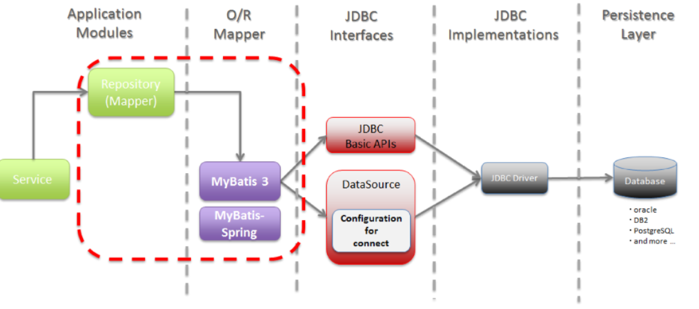

# JPA vs Mybatis

# 영속성

- 데이터를 생성한 프로그램이 종료되더라도 사라지지 않는 데이터의 특성
- 영속성을 갖지 않는 데이터는 단지 메모리에서만 존재하기 때문에 프로그램을 종료하면 모두 잃어버리게 된다. 때문에 파일 시스템, 관계형 테이터베이스 혹은 객체 데이터베이스 등을 활용하여 데이터를 영구하게 저장하여 영속성 부여

## Persistence Layer

- 데이터에 영속성을 부여해주는 계층
- framework를 이용한 개발이 많이 이루어짐



### Persistence Framework

- JDBC 프로그래밍의 복잡함이나 번거로움 없이 간단한 작업만으로 데이터베이스와 연동되는 시스템을 빠르게 개발할 수 있으며 안정적인 구동을 보장
- SQL Mapper vs ORM

# SQL Mapper , ORM

## ORM

데이터 베이스 객체를 자바 객체로 매핑함으로써 객체간의 관계를 바탕으로 SQL을 자동으로 생성해줌, 관계형 데이터베이스의 `관계`를 object에 반영하자는 것이 목적

- 데이터베이스 데이터 ← 매핑 → object 필드
    - 객체를 통해 간접적으로 데이터를 다룬다
- 객체와 관계형 데이터베이스의 데이터를 자동으로 매핑 해주는 것을 말한다.
    - ORM을 이용하면 SQL query가 아닌 직관적인 코드로 데이터를 조작
    - 객체간의 관계를 바탕으로 SQL을 자동으로 생성

```java
public String getPersonName(long personId) {
    Person p = em.find(Person.class, personId);
    return p.getName();
}
```

### 장단점

장점

1. **객체 지향적인 코드로 인해 더 직관적이고 비즈니스 로직에 더 집중할 수 있게 도와준다.**
2. **재사용 및 유지보수의 편리성이 증가한다.**
3. **DBMS에 대한 종속성이 줄어든다.**

단점

1. 완벽한 ORM으로만 서비스를 구현하기 어렵다
2. 프로시저가 많은 시스템에선 ORM의 객체 지향적인 장점을 활용하기 어렵다

[참고](https://github.com/WeareSoft/tech-interview/blob/master/contents/db.md#orm%EC%9D%B4%EB%9E%80)

## SQL Mapper

SQL을 명시, 단순히 필드를 매핑시키는 것이 목적

- SQL ← 매핑 → object 필드
- SQL문장으로 직접 데이터베이스 데이터를 다룬다.

---

# 1. JDBC



- DB에 접근할 수 있도록 Java에서 제공하는 API
    - 모든 Java의 Data Access 기술의 근간
    - 즉, 모든 Persistence Framework는 내부적으로 JDBC API를 이용

# 2. JPA



- 자바 ORM 기술에 대한 API 표준 명세로, java에서 제공하는 API이다
    - 응용프로그램에서 관계형 데이터베이스의 관리를 표현하는 자바 API
    - ORM을 사용하기 위한 표준 인터페이스를 모아둔 것
    - 기존에 EJB에서 제공되던 엔터티 빈을 대체하는 기술
- 구성요소
    1. `javax.persistance` 패키지로 정의 된 API 그자체
    2. [JPOL](https://happygrammer.tistory.com/149)
    3. 객체/관계 메타데이터
- 사용자가 원하는 JPA 구현체를 선택해서 사용가능
    - Hibernate, EclipseLink, DataNucleus, OpenJPA, TopLink Essentials
    → ORM Framework

# Hibernate



- JDBC API가 메서드 내부에서 동작, 단지 개발자가 직접 SQL을 작성 X
- HQL이라 불리는 매우 강력한 쿼리 언어를 포함
    1. HQL은 완전히 객체 지향적이며 이로써 상속, 다형성, 관계등의 객체지향의 강점을누릴 수 있다.
    2. HQL쿼리는 자바 클래스와 프로퍼티의 이름을 제외하고는 대소문자를 구분한다.
    3. HQL은 쿼리 결과로 객체를 반환하며 프로그래머에 의해 생성되고 직접적으로 접근할 수 있다.
    4. HQL은 SQL에서는 지원하지 않는 페이지네이션이나 동적 프로파일링과 같은 향상된 기능을 제공한다.
    5. HQL은 여러 테이블을 작업할 때 명시적인 join을 요구하지 않는다.

- 장점
    - 객체지향적으로 데이터를 관리할 수 있기 때문에 비즈니스 로직에 집중 할 수 있으며, 객체지향 개발이 가능하다.
    - 테이블 생성, 변경, 관리가 쉽다. (JPA를 잘 이해하고 있는 경우)
    - 로직을 쿼리에 집중하기 보다는 객체자체에 집중 할 수 있다.
    - 빠른 개발이 가능하다.
- 단점
    - 어렵다
    - 잘 이해하고 사용하지 않으면 데이터 손실이 있을 수 있다
    - 성능상 문제가 있을 수 있다

# 3. Mybatis



- 개발자가 지정한 SQL, 저장 프로시저 그리고 몇가지 고급 매핑을 지원
- 빠른 개발과 편리한 테스트 환경을 제공 → JDBC로 처리하는 상당 부분 대신해줌

- 장점
    - SQL에 대한 모든 컨트롤을 하고자 할때 매우 적합
    - SQL 쿼리들이 매우 잘 최적화 되어 있을 때 유용
- 단점
    - 애플리케이션과 데이터베이스 간의 설계에 대한 모든 조작을 하고자 할때는 부적합
    -
