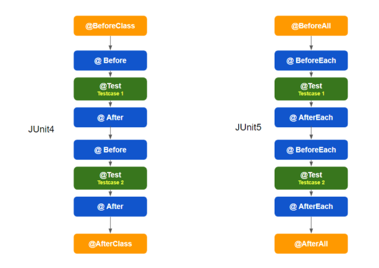

# Junit

> java의 단위 테스팅 도구
단 하나의 Jar파일로 되어 있다. Test Class를 그대로 남김으로써 추 후 개발자에게 테스트 방법 및 클래스의 History를 넘겨줄 수 있다.
> 



jUnit4 = All in one : java5

**JUnit5 = JUnit Platform + JUnit Jupiter + JUnit Vintage : java8**

테스트 작성자를 위한 API 모듈과 테스트 실행을 위한 API가 분리

### JUnit Platform

- JUnit Platform 은 JVM에서 테스트 프레임워크를 시작하기 위한 기반을 제공합니다.
- 또한, 플랫폼에서 실행되는 테스트 프레임 워크 개발을 위한 TestEngine API를 정의합니다.
- 모두가 잘 아는 IDEs(Intellj, Eclipse, VS Code), 빌드 도구(Gradle, Maven, Ant) 에서도 JUnit Platform을 지원합니다.

### JUnit Jupiter

- JUnit Jupiter는 JUnit5에서 테스트 작성을 위한 새로운 프로그래밍 모델과 확장 모델 조합입니다.
- 즉, 테스트를 하기 위한 것들이 포함되어 있다고 생각하면 됩니다.

### JUnit Vintage

- 플랫폼에서 JUnit3, JUnit4기반한 테스트 코드가 실행될 수 있는 TeseEngine을 제공합니다.

## 특징

- 단위 테스트 Framework 중 하나
- [단정문](http://junit.sourceforge.net/javadoc/org/junit/Assert.html)으로 테스트케이스의 수행 결과를 판별
- Annotation으로 간결하게 사용가능

## 어노테이션

### 초기화

```java
@Before
pulbic void Setup(){
//setup before testing
}
```

@Before 어노테이션을 이용하면 테스트 클래스 안의 메소들이 테스트 전에 실행할 코드를 정의

@BeforeClass 어노테이션을 사용한다면 메소드들이 몇번 실행되건 테스트 전 해당클래스에서 단 한번만  실행하도록 할 수 있다.

### 해제

```java
@After
public void tearDown(){
 //teardown after testing
}
```

@After 어노테이션을 선언한다면 테스트 클래스 안의 메소드들이 테스트 후 실행할 코드를 정의

@AfterClass 어노테이션을 사용한다면 메소드들이 몇번 실행되건 테스트 전 해당클래스에서 단 한번만  실행하도록 할 수 있다.

### 테스트 메소드

```java
@Test
public void testSum(){
//testing
}
```

@Test 어노테이션을 선언하면 메소드를 테스트 대상으로 지정할 수 있다.

### 테스트 메소드 수행시간 제한

```java
@Test(timeout=5000)
public void testSum(){
//testing
}
```

@Test(timeout=mili second)어노테이션을 선언하면 밀리 초 단위로 메소드의 수행시간을 제한하여 테스트 

### 테스트 메서드에 Exception

```java
@Test(excepted=RuntimeException.class)
public void testSum(){
//testing
}
```

@Test(excepted=exception.class)선언하면 선언된 exceptiong을 발생시켜야 테스트가 성공되도록 함

- **@Test** : 메서드가 테스트 메서드임을 나타냅니다.
- **@ParameterizedTest** : 메서드가 매개 변수가 있는 테스트임을 나타냅니다.
- **@RepeatedTest** : 반복 테스트를 위한 메소드임을 나타냅니다.
- **@TestFactory** : 동적 테스트를 위한 테스트 팩토리 메소드를 나타냅니다.
- **@TestTemplate** : 여러번 호출되도록 설계된 테스트 케이스의 템플릿임을 나타냅니다.
- **@TestMethodOrder** : 테스트 메소드 실생 순서를 구성하는데 사용됩니다.
- **@TestInstance** : 테스트 라이프 사이플을 구성하는데 사용됩니다.
- **@DisplayName** : 테스트 클래스 또는 테스트 메서드에 대한 사용자 지정 표시 이름을 설정합니다.
- **@DisplayNameGeneration** : 테스트 클래스에 대한 커스텀 이름 생성기를 생성합니다.
- **@BeforeEach** : 모든 테스트 메소드 실행 전에 실행되는 메소드입니다.
- **@AfterEach** : 모든 테스트 메소드 실행이 끝나면 실행되는 메소드입니다.
- **@BeforeAll** : 하나의 테스트 실행 전에 실행되는 메소드입니다.
- **@AfterAll** : 하나의 테스트 실행이 끝나면 실행되는 메소드입니다.
- **@Nested** : non-static 중첩 클래스임을 나타냅니다.
- **@Tag** : 새로운 태그를 선언할 때 사용됩니다.
- **@Disable** : 테스트 클래스나 테스트 메소드를 사용하지 않도록 할 때 사용됩니다.
- **@Timeout** : 주어진 시간안에 실행을 못할 경우 실패하도록 하는데 사용됩니다.

# Assert Method

- **assertEquals(x,y)** : 객체 x,y가 일치함을 확인합니다.
- **assertArayEquals(a,b)** : 배열 A와 B가 일치함을 확인합니다.
- **assertFalse(x)** : x가 false인지 확인합니다.
- **assertTrue(x)** : x가 True인지 확인합니다.
- **assertNull(x)** : 객체 x가 null인지 확인합니다.
- **seertNotNull(x)** : 객체 x가 null이 아닌지 확인합니다.
- **assertSame(x,y)** : 객체 x와 y가 같은 객체의 레퍼런스임을 확인합니다. (30 != 30.0)
- **asswertNotSame(x,y)** : 객체 x와 y가 같은 객체의 레퍼런스가 아닌지 확인합니다.
- **asserfail()** : 테스트를 실패 처리합니다.