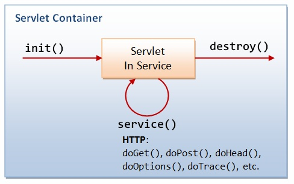

# Servlet

---

- Servlet

JVM 기반에서 웹개발을 하기 위한 명세이자 API → 웹 애플리케이션 컨테이너 필요

---

# 생명주기



1. 초기화 : 서블릿의 인스턴스를 생성하고 리소스를 로드하는 등 클래스 생성자의 초기화 작업과 동일한 역할
2. 서비스 : 클라이언트 요청에 따라 호출할 메서드를 결정
3. 소멸 : 서블릿이 언로드 된다.

---

# 관련 객체들

## 필터

- 요청에 대해서 전처리 작업이 필요한 경우가 있다. → 필터 사용
- 필터가 서블릿보다 먼저 동작

## 쿠키

- 사용자의 컴퓨터에 저장되는 정보
- 구성 요소
    - 이름
    - 값
    - 유효시간
    - 도메인
    - 경로

```java
//쿠키 생성
Cookie cookie=new Cookie(name,value);

//유효 시간 설정
cookie.setMaxAge(number);
//쿠키 추가
response.addCookie(cookie);

//쿠키 수정 
Cookie[] cookies=request.getCookies();

for(Cookie c:cookies){
	if(cookie.getName().equals(name)){
		Cookie modifycookie=new Cookie(name,"new");
		response.addCookie(modifycookie);
	}
}

//쿠키 삭제

for(Cookie c:cookies){
	if(cookie.getName().equals(name)){
		Cookie deletecookie=new Cookie(name,"new");
		deletecookie.setMaxAge(0);
		response.addCookie(modifycookie);
	}
}
```

## 세션

- session은 서버와 클라이언트의 유효한 커넥션을 식별하는 정보
- HttpSession 인터페이스 구성

```java
//세션 생성
HttpSession session= request.getSession();

/*
getId : 고유한 아이디 메서드
getCreationTime : 세선 생성된 시간 메서드
getLastAccessTime : 웹브라우저가 마지막에 세션에 접근한 시간 메서드
*/

//세선 값 저장
session.setAttribute(name,value);

//세션 값 삭제
session.invaldate();

```

---

# 디자인 패턴 활용

## Java EE 패턴

- 자바 웹 개발 시에 겪는 문제를 해결하는 실마리를 제공

## 프론트 컨트롤러 패턴

- 컨트롤러가 공통 요청을 먼저 수행하고 뷰를 호출하는 패턴

### 화면 전환 방법

1.  response의 sendRedirect → 어떠한 url로든 바로 이동
2. RequestDispatcher의 forward → request에 값을 넣어서 전달 가능 , 절대 경로 사용
