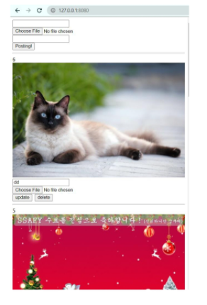

# Spring Boot 인별그램 만들기

# ‼️목표

- 이미지 파일을 업로드 하여 화면에 보여주는 것!



# 🖥️개발 환경

- Spring boot (back-end)
- vuejs (front-end)
- JPA (ORM)
- H2 (database)

# 🏗️아키텍처


- Server : RestController 로 만들어 API로 설계
- Clinet : 서버에 대한 요청에 대한 결과만 화면단에서 보여주기

# 👢boot 설정


- H2 database
    - 실습용 데이터베이스로 간단하게 사용 가능
    - mem형식으로 서버가 재로딩시 새로 생긴다.
- JPA
    - JPA 구현체 중 hibernate을 기본으로 설정
    - ORM(객체 릴레이션 맵핑) 으로 객체-관계를 중심으로
- Lombok
    - Setter getter 등 필요한 메서드를 어노테이션으로 제공
    - 소스의 간결화 및 가용성 증가
- Spring Boot DevTools
    - 소스가 바뀌면 동적으로 서버가 재기동되는 기능
- Spring Web
    - Rest형태를 이용하기 위한 설정

# 🧬엔티티 (DTO)

```java
@Entity
@NoArgsConstructor
@Getter
@Setter
public class Content {
    @Id @GeneratedValue(strategy = GenerationType.IDENTITY)
    private int uid;

    private String path;
    private String title;
    private String password;

    @Builder
    public Content(String path, String title, String password) {
        super();
        this.path = path;
        this.title = title;
        this.password = password;
    }
}

```

- DB의 테이블을 구성

# 🏪Repository

```java
import org.springframework.data.jpa.repository.JpaRepository;

import java.util.List;

public interface ContentRepository extends JpaRepository<Content,Integer> {
    public List<Content> findTop1000ByOrderByUidDesc();
}

```

- JpaRepository : 기본 CRUD 제공

# ☘️CRUD

## 사진 목록조회

```java
@GetMapping
public List<Map<String,Object>> list(){
    List<Map<String,Object>>result=new ArrayList<>();
    List<Content> contents = contentRepository.findTop1000ByOrderByUidDesc();
    for (Content content:contents) {
        Map<String,Object>con=new HashMap<>();
        con.put("uid",content.getUid());
        con.put("path",content.getPath());
        con.put("title",content.getTitle());
        result.add(con);
    }
    return result;
}
```

## 사진 등록

```java
@PostMapping
public Map<String,String> post(@RequestPart("picture")MultipartFile pic,
                               @RequestParam("title")String title,
                               @RequestParam("password")String password) throws IOException{
    String path=System.getProperty("user.dir");//현재디렉토리 경로
    String savepath=path+"/src/main/resources/static/"+pic.getOriginalFilename();
    File file=new File(savepath);
    if(!file.getParentFile().exists()) file.getParentFile().mkdirs();
    pic.transferTo(file);
    contentRepository.save(
            Content.builder()
            .password(password)
            .title(title)
                    .path(file.getName())
            .build()).getUid();

    return Map.of("path",file.getName());
}
```

## 사진 수정

```java
@PutMapping("/{uid}")
public Map<String,String>update(@PathVariable int uid,@RequestPart("picture") MultipartFile pic,
                                @RequestParam("title")String title,
                                @RequestParam("password")String password) throws IOException{
    Optional<Content> content = contentRepository.findById(uid);

    if (content.get().getPassword().equals(password)){

        if(!pic.isEmpty()){
            String path=System.getProperty("user.dir");//현재디렉토리 경로
            String savepath=path+"/src/main/resources/static/"+pic.getOriginalFilename();
            File file=new File(savepath);
            if (!file.exists()){
                //file.mkdir();
                pic.transferTo(file);
                content.get().setPath(pic.getOriginalFilename());
            }

        }
        content.get().setTitle(title);
        contentRepository.save(content.get());
    }

    Map<String,String>result=new HashMap<>();
    result.put("path",pic.getOriginalFilename());
    return result;
}
```

## 사진 삭제

```java
@DeleteMapping("/{uid}")
public void delete(@PathVariable int uid,@RequestBody Map<String,Object>body){
    
		Optional<Content> content = contentRepository.findById(uid);
    if (content.get().getPassword().equals(body.get("password"))){
        contentRepository.delete(content.get());
    }
}
```

# 🖕결과


