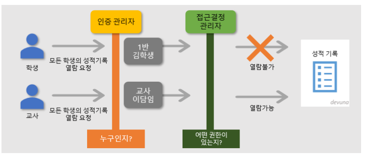

# Spring Security

# 💡스프링 시큐리티 란?

- 스프링 기반의 애플리케이션의 보안(인증과 권한, 인가 등)을 담당하는 스프링 하위 프레임 워크입니다. 즉 인증(Authenticate) 과 인가(Authorize)를 담당하는 프레임 워크
- 서블릿 filter와 이들로 구성된 필터체인으로의 구성된 위임모델을 사용
- 보안과 관련해서 체계적으로 많은 옵션을 제공해주기 때문에 개발자 입장에서는 일**일이 보안관련 로직을 작성하지 않아도 된다는  장점**

## 🍎스프링 시큐리티 특징과 구조

- 보안과 관련하여 체계적으로 많은 옵션을 제공하여 편리
- Filter 기반으로 동작하여 MVC와 불니하여 관리 및 동작
- 어노테이션을 통한 간단한 설정
- Spring Security는 기본적으로 세션 & 쿠키방식으로 인증

- **인증관리자** 와 **접근 결정 관리자**를 통해 사용자의 리소스 접근을 관리
- 인증 관리자는**UsenamePasswordAuthenticationFilter** 접근 결정 관리자는**FilterSecurityInterceptor**

## 🍇기본 구조

## ✔️필터별 기능 설명

- **SecurityContextPersistenceFilter**

SecurityContextRepository에서 SecurityContext를 로드하고 저장하는 일을 담당함

- **LogoutFilter**

로그아웃 URL로 지정된 가상URL에 대한 요청을 감시하고 매칭되는 요청이 있으면 사용자를 로그아웃시킴

- **UsernamePasswordAuthenticationFilter**

사용자명과 비밀번호로 이뤄진 폼기반 인증에 사용하는 가상 URL요청을 감시하고 요청이 있으면 사용자의 인증을 진행함

- **DefaultLoginPageGeneratingFilter**

폼기반 또는 OpenID 기반 인증에 사용하는 가상URL에 대한 요청을 감시하고 로그인 폼 기능을 수행하는데 필요한 HTML을 생성함

- **BasicAuthenticationFilter**

HTTP 기본 인증 헤더를 감시하고 이를 처리함

- **RequestCacheAwareFilter**

로그인 성공 이후 인증 요청에 의해 가로채어진 사용자의 원래 요청을 재구성하는데 사용됨 SecurityContextHolderAwareRequestFilter HttpServletRequest를HttpServletRequestWrapper를 상속하는 하위 클래(SecurityContextHolderAwareRequestWrapper)로 감싸서 필터 체인상 하단에 위치한 요청 프로세서에 추가 컨텍스트를 제공함

- **AnonymousAuthenticationFilter**

이 필터가 호출되는 시점까지 사용자가 아직 인증을 받지 못했다면 요청 관련 인증 토큰에서 사용자가 익명 사용자로 나타나게 됨

- **SessionManagementFilter**

인증된 주체를 바탕으로 세션 트래킹을 처리해 단일 주체와 관련한 모든 세션들이 트래킹되도록 도움

- **ExceptionTranslationFilter**

이 필터는 보호된 요청을 처리하는 동안 발생할 수 있는 기대한 예외의 기본 라우팅과 위임을 처리함

- **FilterSecurityInterceptor**

이 필터는 권한부여와 관련한 결정을 AccessDecisionManager에게 위임해 권한부여 결정 및 접근 제어 결정을 쉽게 만들어 줌

[참고](https://devuna.tistory.com/55)
