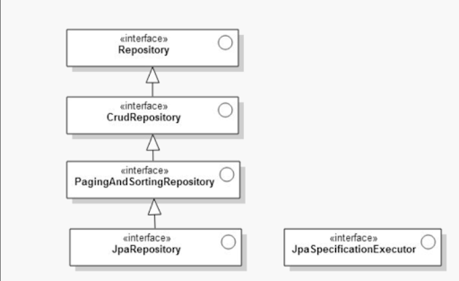
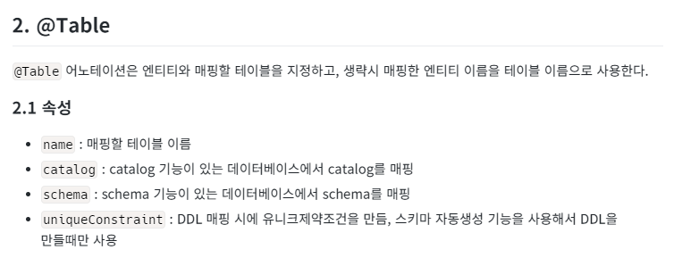
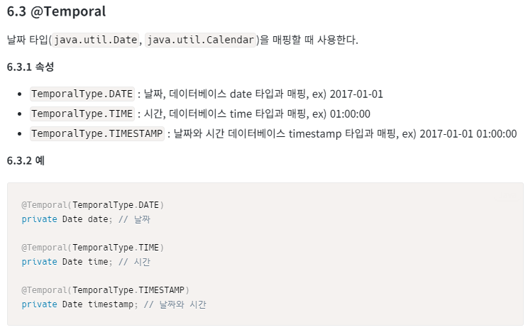

# 데이터베이스 프로그래밍

# ❌  데이터베이스 일반 쿼리문을 이용하는 문제점 :jdbc

> 시스템의 규모가 커지고 로직이 복잡해짐에 따라 길어진 쿼리문을 문자열과 소스가 결합된 형태로 개발하는것에 불편함이 생김
→ SQL Mapper ,ORM으로 주된 개발을 진행

- spring-boot-starter-web : 임베디드된 톰캣을 사용하지 않고 실행 할 수 있다. 내장된 걸 사용 X

# ORM도구 활용

ORM 이란 객체와 Relation간의 불일치 문제를 해결하기위한 도구
→ 코드의 반복을 중리고 좀더 객체 중심의  설계에 집중해서 개발을 진행

## 0️⃣Spring Data JPA

### JPA

- 객체와 관계형 데이터베이스의 매핑이므로 대상이 관계형 데이터베이스로 한정되어 있다.

### Spring Data

- 스프링 데이터는 NOSQL 또는 RDBMS 어느 한쪽만을 목표로 하지 않으므로 Spring Data의 추상화된 인터페이스를 통해서 MySQL,ElasticSearch,Redis 등 다양한 저장소에 활용 가능

### Spring DATA JPA 설정

- Spring-boot-starter-data-jpa 라이브러리 추가

### Repository 구조



베이스가 되는 Repository인터페이스에는 아무런 메서드가 없다.

@noRepository 어노테이션

- 사용자가 정의한 Repository와 골격이 되는 SpringData Repository 인터페이스들을 구분해서 사용자가 만든 Repository들만 스프링이 인식하는 빈이 되도록 하는 것이다

## 1️⃣데이터베이스와 객체 매핑

### Entity 클래스 설정

- 데이터베이스 스키마의 내용을 자바 클래스로 표현 할 수 있는 대상을 Entity 클래스라고 한다. Entity 클래스는 해당 클래스에 @Entity 어노테이션을 선언하는 것으로 엔티티 매니저가 관리해야 할 대상임을 인식시킬 수 있다.

### 데이터베이스와 키 매핑

- 데이터 베이스와 자바 클래스 간의 매핑 시에 가장 중요한 역할을 하는 요소를 뽑으면 바로 이 키값.
- auto_increment,squence와 같이 유일성을 보장하는 요소들과 키 값 역할을 하는 클래스의 필드를 매핑함으로써 유일성을 보장



```java
@Entity // 클래스와 테이블 매핑
@Table(name = "MEMBER") // 매핑할 테이블 정보 명시
public class Member {

    @Id // 기본키 매핑
    @Column(name = "ID") // 필드를 컬럼에 매핑
    private String id;

    @Column(name = "NAME")
    private String username;

    private Integer age; // 매핑 정보가 없을 경우 필드명이 컬럼명으로 매핑

    // 회원 타입 구분
    @Enumerated(EnumType.STRING)
    private RoleType roleType;

    // 날짜 타입 매핑
    @Temporal(TemporalType.TIMESTAMP)
    private Date createdDate;

    // 날짜 타입 매핑
    @Temporal(TemporalType.TIMESTAMP)
    private Date lastModifiedDate;

    @Lob // 길이 제한 없음
    private String description;

    // getter, setter
}
```

- @Table은 클래스명과 테이블명을 같게 하는 경우가 다반사
- @Table(name = "MEMBER") — 클래스 명과 테이블명이 다르게 매칭될수 잇다

### 날짜 형식 매핑



### Repository

- entity 클래스가 데이터베이스 테이블을 매핑하는 역할을 한다면,
- Repository는 Entity 조작에 필요한 쿼리를 매서드화해서 사용할 수 있는 역할

```java
@Repository
public interface UserRepository extends JpaRepository<UserEntity, Long>{
    UserEntity findByUserName(@Param("userName") String userName);
}
```

- 쿼리메서드 사용

반환 타입 findBy 필드명(파라미터);

```java
@SpringBootApplication
public class JPAMain{
        public static void main(String[] args) {
                ConfigurableApplicationContext context = SpringApplication.run(JPAMain.class, args);
                UserRepository userRepository = context.getBean(UserRepository.class);

                userRepository.save(new UserEntity("윤사장", 60, UserRole.ADMIN));
                UserEntity user = userRepository.findByUserName("윤사장");
                System.out.println("나이:" + user.getAge() + "," + "이름:" + user.getUserName() + "," + "생성일:" + user.getCreatedAt());
        }
}
```

## 연관 관계

- 하나 이상의 객체가 연결되어 있는 상태를 나타낸다.

@ManyToOne or OneToMany와 같은 어노테이션을 사용

- ManyToOne 어노테이션은 즉시 로딩이 기본값이다. 즉시 로딩으로 실행될 때는 연결된 엔티티 정보까지 한 번에 가져오려고 하므로 성능에 문제가 발생할 수 있다.
- FetchType.LAZY를 지정해서 지연 로딩되도록 하는 것이 좋다.

```java
@Service
public class SchoolService {
    @Autowired
    private SchoolRepository schoolRepository;
    @Autowired
    private StudentRepository studentRepository;

    @Transactional
    public void findStudentInfo() {
        School school = new School("매력고");
        schoolRepository.save(school);

        Student stu1 = new Student("나라");
        Student stu2 = new Student("민하");
        Student stu3 = new Student("나나");

        stu1.setSchool(school);
        stu2.setSchool(school);
        stu3.setSchool(school);

        studentRepository.save(stu1);
        studentRepository.save(stu2);
        studentRepository.save(stu3);

        List<Student> students = studentRepository.findAll();

        for (Student s : students) {
            System.out.println(s.getUserName() + "," + s.getSchool().getName());
        }
    }

    @Transactional
    public void findSchoolInfo() {
        School sc1 = new School("예체능고");
        sc1.registerStudent(new Student("홍길동"));
        sc1.registerStudent(new Student("유재석"));

        School sc2 = new School("매력고");
        sc2.registerStudent(new Student("나라"));
        sc2.registerStudent(new Student("민하"));

        schoolRepository.save(new HashSet<School>() {{
            add(sc1);
            add(sc2);
        }});

        List<School> schools = schoolRepository.findAll();

        for (School s : schools) {
            System.out.println(s.toString());
        }
    }
}
```

# QueryDSL을 이용한 TypeSafe한 쿼리 작성

- JPA가 너무 정적이어서 서브쿼리나 집계함수와 같은 동적인 쿼리를 처리할 수없다는 인식이 있다.
- select * from 테이블 대신 from(userEntity) 사용

## QueryDslRepositorySupport 활용

- Q클래스 설정
- 커스텀 Repository 생성 - JPA에서 지원하지 않는 쿼리에 대한
- QueryDslRepositorySupport 구현체작성

### LIKE 메서드

```java
public interface UserRepositoryCustom {
    List findAllLike(String keyword);

    int maxAge();

    int minAge();
}
```

```java
public UserRepositoryImpl(Class<?>domainClass){
super(domainClass);}
```

- QueryDslRepository는 기본생성자가 없고 생성자가 domainClass 파라미터를 필요로 한다는 것
- 기본생성자가 없어서 Support를 상속받은 클래스에서는 기본 생성자를 만들 수 없다.

```java
public class UserRepositoryImpl extends QueryDslRepositorySupport implements UserRepositoryCustom {
    public UserRepositoryImpl() {
        super(UserEntity.class);
    }

    @Override
    @Autowired
    public void setEntityManager(EntityManager entityManager) {
        super.setEntityManager(entityManager);
    }
```

- super를 이용하여 부모클래스의 생성자를 호출해서 파라미터로 전달

```java
@Override
    public List findAllLike(String keyword) {
        QUserEntity qUserEntity = QUserEntity.userEntity;
        JPQLQuery<UserEntity> query = from(qUserEntity);
        List<UserEntity> resultlist =
		        query
				        .where(qUserEntity.username.like(keyword))
				        .fetch();

        return resultlist;
    }
```

### 집계함수

```java
@Override
    public int maxAge() {
        QUserEntity qUserEntity = QUserEntity.userEntity;
        return from(qUserEntity).select(qUserEntity.age.max()).fetchOne();
    }

    @Override
    public int minAge() {
        QUserEntity qUserEntity = QUserEntity.userEntity;
        return from(qUserEntity).select(qUserEntity.age.min()).fetchOne();
    }
```

- fetchOne == selectOne

# 쿼리 매퍼

## Mybatis

1. 의존성 설정
2. SqlSessionTemplate 설정 →SqlSessionFactory에서는 sql매퍼들이 위치하는 경로와 Mybatis설정파일 경로 지정
3. 데이터베이스 설정
4. 스키마 생성 및 초기 데이터 적재

## Mapper XMl 작성

```xml
<?xml version="1.0" encoding="UTF-8" ?>
<!DOCTYPE mapper
        PUBLIC "-//mybatis.org//DTD Mapper 3.0//EN"
        "http://mybatis.org/dtd/mybatis-3-mapper.dtd">

<mapper namespace="sample.mapper.userMapper">

    <resultMap id="userResultMap" type="info.thecodinglive.model.UserVO">
        <result property="id" column="id"/>
        <result property="userName" column="username"/>
        <result property="passWord" column="password"/>
    </resultMap>

    <select id="selectUserInfoAll" resultType="hashMap">
    <![CDATA[
		SELECT id, username, password
		FROM TBL_USER
	]]>
    </select>

    <insert id="addUserInfo" >
    <![CDATA[
        insert into TBL_USER(id ,username, password)
        values(#{id},#{userName}, #{passWord})
     ]]>
    </insert>

    <select id="findByUserNameLike" parameterType="map" resultType="hashMap">
    <![CDATA[
      SELECT
            ID,
            USERNAME,
            PASSWORD
      FROM TBL_USER
      WHERE USERNAME LIKE '%${userName}%'
     ]]>
    </select>

    <select id="findByUserName" parameterType="map" resultMap="userResultMap">
    <![CDATA[
      SELECT
            ID,
            USERNAME,
            PASSWORD
      FROM TBL_USER
      WHERE USERNAME =#{userName}
      ]]>
    </select>
</mapper>
```

- id는 함수명과 같아야된다.
- resultMap은 반환 타입

## 동적 쿼리 태그

1. if 태그 활용
2. foreach 태그 활용
