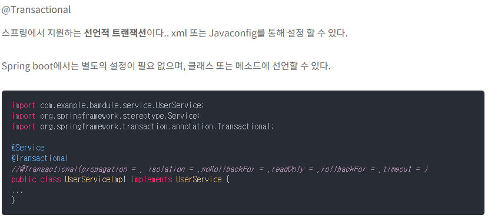
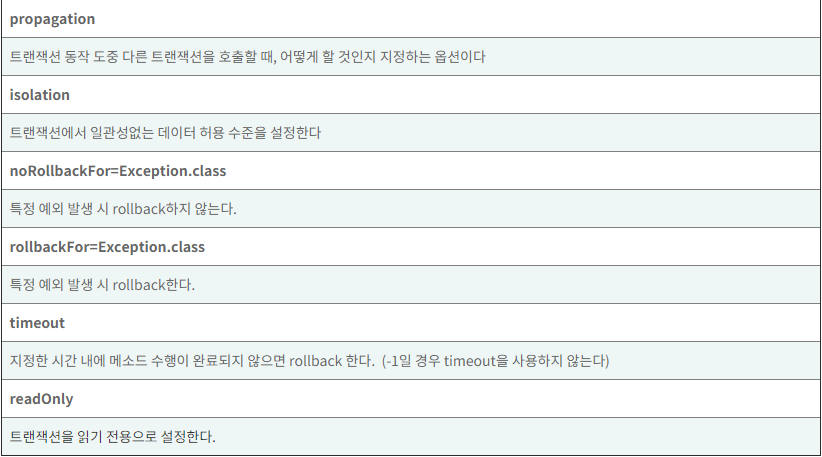

# 자바 예외 처리

# Throw vs Throws

## Throw

```java
public class ThrowExample {
    void validAge(int age){
        if(age<19)
            throw new ArithmeticException("소주를 구매할 수 없습니다.");
        else
            System.out.println("소주를 구매할 수 있습니다.");
    }
    public static void main(String args[]){
        ThrowExample obj = new ThrowExample();
        obj.validAge(13);
        System.out.println("end");
    }
}
```

- 메서드 안에서 예외를 발생시킬 때 사용

## Throws

```java
public class ThrowsExample {
    int division(int a, int b) throws ArithmeticException{
        int t = a/b;
        return t;
    }
    public static void main(String args[]){
        ThrowsExample obj = new ThrowsExample();
        try{
            System.out.println(obj.division(15,0));
        }
        catch(ArithmeticException e){
            System.out.println("0으로 나눌 수 없습니다.");
        }
    }
}
```

- 메서드를 호출하는 쪽에서 예외 처리를 원할 때

# Validation 활용

- API를 개발하다 보면 JSON객체로 전달받는 경우가 있는데 JSON 객체는 파라미터가 되는 필드들이 객체로 감싸져있어서 어떤 필드가 null인지 판단하지 못한다.

```java
@RequestMapping(value = "/regist", method = RequestMethod.POST)
    public ResponseEntity<?> registUser(@Validated @RequestBody UserVO userVO){
        System.out.println("controller vo check::" + userVO.toString() );
        userService.createUser(userVO);
        return new ResponseEntity(null, HttpStatus.OK);
    }

@NotNull(message = "userName필드가 null입니다.")
    private String userName;
```

- notnull과 Validation 어노테이션을 이용하여 null일 경우에 판단

# 👁️데이터베이스 예외 처리

- 예외가 가장 빈번하게 발생하는 건  : 파일 입출력과 데이터베이스 연동
- 데이터베이스 서버의 경우에는 동시에 여러 사람들이 사용하므로 트랜잭션 제어에 대한 이해가 필요하다.

## 트랜잭션

하나의 논리적인 작업 단위를 구성하는 일련의 연산들의 집합

ex) 계좌 이체

### 트랜잭션 성질

- 원자성
- 일관성
- 독립성
- 지속성(영속성)

### JDBC와 트랜잭션

- JDBC: java Database Connection , 자바에서 데이터베이스 서버에 접속할 수 있도록 하는 스펙이자 API



- 트랜잭션 옵션



- Repository, Service와 같은 계층을 나눠서 개발을 진행하는 이유는  레포지터리 레이어에서는 하나의 데이터베이스 테이블을 대상으로 데이터를 입력하거나 조회, 갱신 등의 기능을 수행
- service 레이어는 이런 메서드들을 모아서 한번의 요청안에서 여러 테이블들을 조회하거나 갱신할 필요가 있다.
- —> 그래서 대부분 트랜잭션에 대한 롤백 설정은 Service에서 처리
