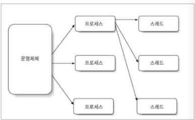
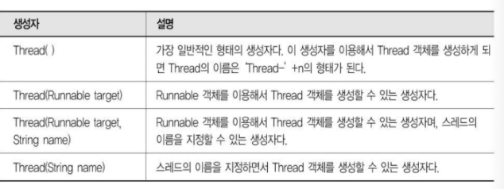
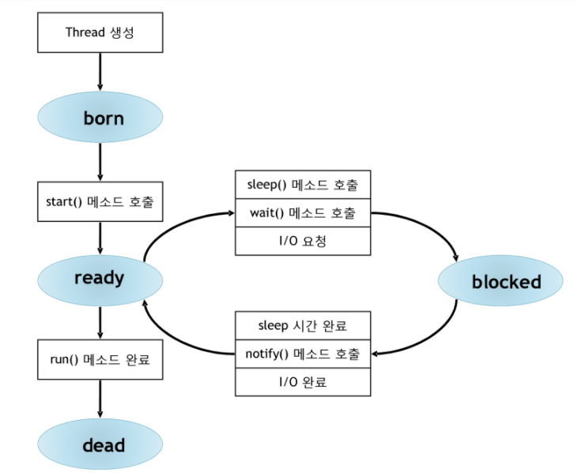

# Thread

# 쓰레드

- 멀티 태스킹
    - 프로세스란  운영체제에서 실행중인 하나의 프로그램

        

    - 멀티 프로세스란 두 개 이상의 프로세스가 실행되는 것
    - 멀티 태스킹이란 두 개 이상의 프로세스를 실행하여 일을 처리
- 멀티 쓰레드
    - 스레드란 프로세스 내에서 실행되는 세부 작업 단위

        

    - 멀티스레드란 하나의 프로세스에서 여러 개의 스레드가 병행적으로 처리되는 것
- 스레드의 생성 방법

    

    - Thread 클래스를 상속 받는 방법
    - Runnable 인터페이스를 구현하는 방법
    - Thread 클래스 생성자

## 생명주기

## 쓰레드 스케줄러

- 쓰레드의 상태를 관리함( 자바에서는 전적으로 JVM이 관리 JVM==OS)
- 사용자 마음대로 제어할 수 없음
- 스케줄러가 어떤 특별한 방식으로 작동하는 것을 가정하고 프로그램을 만들면 절대 X
- 우선순위 이외에도 데몬 스레드인지 아닌지 판단하는 플래그 속성

## 데몬스레드

- 서비스 스레드라고도 하고 낮은 우선순위를 갖는 경우가 많음
- 대표적인 데몬 스레드가 가비지 컬렉션

## 병행성 문제

- 두 개 이상의 쓰레드가 어떤 객체에 있는 하나의 데이터에 접근하게 되는 경우
- 서로 다른두 스택에서 실행되는 메소드가 객체에 있는 동일한 객체에 대한 게터또는 세터 메소드를 호출하게 되는 경우
- 자신이 잠시 중단된 적이 있다는 것 기억 X

## 동기화

- 임계영역이란 멀티 스레드에 의해 공유자원이 참조 될 수 있는 코드 범위
- 멀티 스레드 프로그램에서 임계영역을 처리하는 경우 심각한 문제가 발생- 해결 방법이 동기화
- 동기화를 처리하기 위해 모든 객체에 락(LOCK)을 포함
