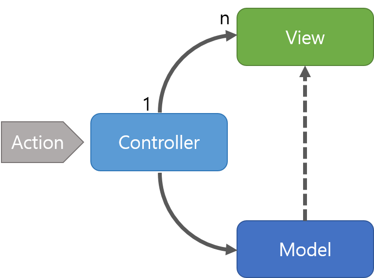
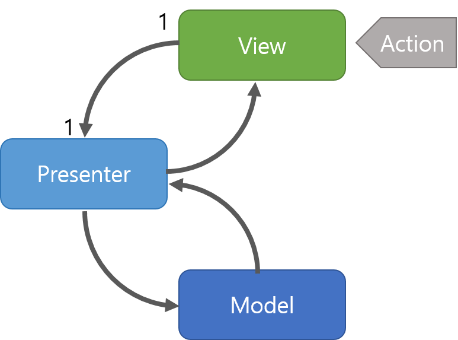
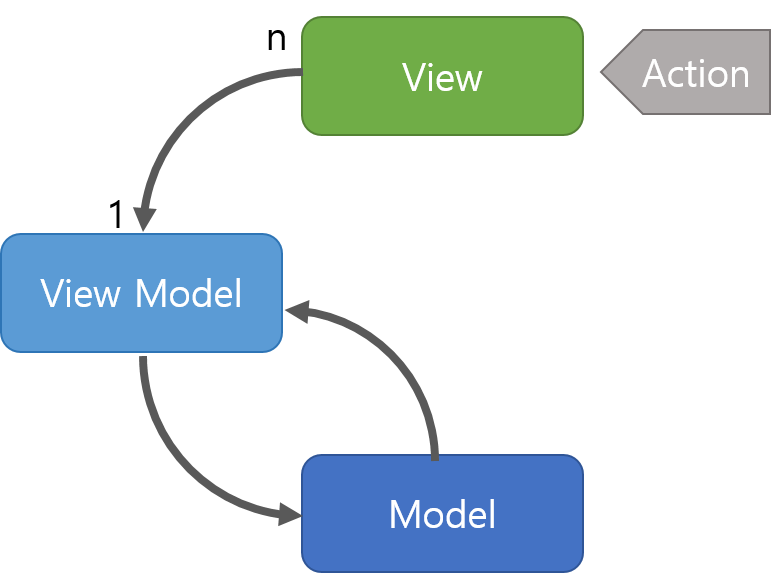

# MVC,MVVM,MVP 패턴

> 각각의 역할을 나눠 코드 관리를 하자!!!!! → 유지보수와 개발효율이 증가
코드를 구성하는 원칙 : 의존성 낮고 응집성이 높게
> 

# MVC

## 구조

Model +View + Controller

- Model : 어플리케이션에서 사용되는 데이터와 그 데이터를 처리하는 부분입니다.
- View : 사용자에서 보여지는 UI 부분입니다.
- Controller : 사용자의 입력(Action)을 받고 처리하는 부분입니다.

## 동작

1. 사용자의 Action들은 Controller에 들어오게 됩니다.
2. Controller는 사용자의 Action를 확인하고, Model을 업데이트합니다.
3. Controller는 Model을 나타내줄 View를 선택합니다.
4. View는 Model을 이용하여 화면을 나타냅니다.

## 특징

Controller는 여러 개 의 VIew를 선택할 수 있는 1 : N 구조

VIew를 선택할 뿐 직접 업데이트 하지 않는다. VIew는 Controller를 알지 못한다.

## 단점

View와 Model 사이의 의존성이 높다. → 어플리케이션이 커질수록 복잡해지고 유지보수가 어렵게 만듬

# MVP

## 구조

Model + View + Presenter . Controller 대신 Presenter가 존재

## 동작

1. 사용자의 Action들은 View를 통해 들어오게 됩니다.
2. View는 데이터를 Presenter에 요청합니다.
3. Presenter는 Model에게 데이터를 요청합니다.
4. Model은 Presenter에서 요청받은 데이터를 응답합니다.
5. Presenter는 View에게 데이터를 응답합니다.
6. View는 Presenter가 응답한 데이터를 이용하여 화면을 나타냅니다.

## 특징

Presenter는 VIew와 model의 인스턴스를 가지고 있어 둘을 연결하는 접착제 역할

Presenter 와 VIew는 1 : 1

## 장점

MVP패턴의 장점은 VIew와 Model의 의존성이 없다는 것

(Presenter를 통해서만 데이터를 전달 받기 때문에..)

## 단점

View와 Presenter  사이의 의존성이 높다. 

# MVVM

## 구조

Model + View + VIew Model

- Model : 어플리케이션에서 사용되는 데이터와 그 데이터를 처리하는 부분입니다.
- View : 사용자에서 보여지는 UI 부분입니다.
- View Model : View를 표현하기 위해 만든 View를 위한 Model입니다. View를 나타내 주기 위한 Model이자 View를 나타내기 위한 데이터 처리를 하는 부분입니다.

## 동작

1. 사용자의 Action들은 View를 통해 들어오게 됩니다.
2. View에 Action이 들어오면, Command 패턴으로 View Model에 Action을 전달합니다.
3. View Model은 Model에게 데이터를 요청합니다.
4. Model은 View Model에게 요청받은 데이터를 응답합니다.
5. View Model은 응답 받은 데이터를 가공하여 저장합니다.
6. View는 View Model과 Data Binding하여 화면을 나타냅니다.

## 특징

Command패턴과 Data Binding 두가지 패턴을 사용하여 구현

Command패턴과 Data Binding 을 이용하여 View 와 VIew model 사이의 의존성을 없앴다.

View model과 view는 1: n 관계

- Command 패턴
  
    실행될 기능을 캡슐화함으로써 주어진 여러 기능을 실행할 수있는 재사용성이 높은 클래스를 설계하는 패턴
    
- Data Binding 패턴
  
    레이아웃의 UI 구성요소를 앱의 데이터 소스와 결합할 수 있는 지원 라이브러리
    

## 장점

MVVM 패턴은 View와 Model 사이의 의존성이 없습니다. 또한 Command 패턴과 Data Binding을 사용하여 View와 View Model 사이의 의존성 또한 없앤 디자인패턴입니다. 각각의 부분은 독립적이기 때문에 모듈화 하여 개발할 수 있습니다.

## 단점

MVVM 패턴의 단점은 View Model의 설계가 쉽지 않다는 점입니다.