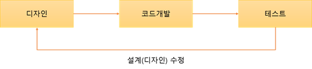

# TDD(Test Driven Development)

## TDD란?

테스트 주도 개발. 반복 테스트를 이용한 소프트웨어 방법론

닥은 단위의 테스트 케이스를 작성하고 이를 통과하는 코드를 추가하는 단계를 반복하여 구현한다.

## 개발주기

RED : **실패하는 테스트 코드**를 먼저 작성

Green : **테스트 코드를 성공시키기 위한 실제 코드** 작성

Yellow : 중복 코드 제거, 일반화 등의 **리팩토링 수행**

## 일반 개발 방식과 TDD 개발 방식의 비교

♦️**일반 개발 방식**

**'요구사항 분석 -> 설계 -> 개발 -> 테스트 -> 배포'**

- 처음부터 완벽한 설계는 어렵다
- 테스트 비용이 증가할 수 있다.

❌ 결론적으로 이러한 코드들은 재사용이 어렵고 관리가 어려워져 유지보수를 어렵게 만든다.

♦️**TDD 개발 방식**

- ****TDD와 일반적인 개발 방식의 한다는 점이다.디자인(설계) 단계에서 프로그래밍 목적을 반드시 미리 정의해야만 하고, 또 무엇을 테스트해야 할지 미리 정의(테스트 케이스 작성)해야만 한다.  테스트 코드를 작성하는 도중에 발생하는 예외 사항(버그, 수정사항)들은 테스트 케이스에 추가하고 설계를 개선한다. 이후 테스트가 통과된 코드만을 코드 개발 단계에서 실제 코드로 작성한다.

    가장 큰 차이점은 테스트 코드를 작성한 뒤에 실제 코드를 작성

🔆 이러한 반복적인 단계가 진행되면서 자연스럽게 코드의 버그가 줄어들고, 소스코드는 간결해진다.

또한, 테스트 케이스 작성으로 인해 자연스럽게 설계가 개선됨으로 재설계 시간이 절감된다

## 장점

- 보다 튼튼한 객체 지향적인 코드 생산
- 재설계 시간의 단축
- 디버깅 시간의 단축
- 테스트 문서의 대체 가능
- 추가 구현의 용이함

## 단점

- 생산성의 저하