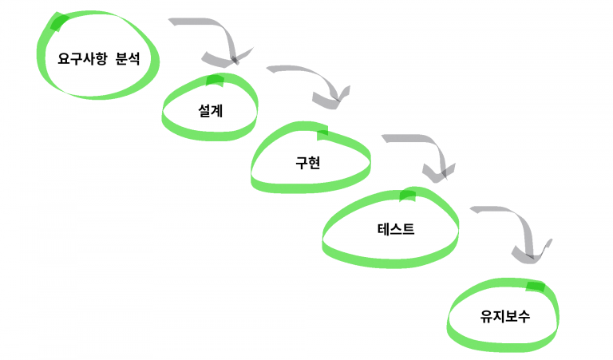

# 개발 방법론

## 폭포수 방법론

### 구성단계

분석 , 설계 , 개발/구현, 테스트 단계를 순차적으로 진행

1) 분석 : 고객의 요구조건, 시스템 환경 등 타당성을 검토하고 요구사항에 대한 명세를 작성.

2) 설계 : 요구사항 명세를 바탕으로 S/W의 전체 구조와 구조간의 관계, 상세 알고리즘 등을 세부적으로 설계.

3) 개발/구현 : 요구사항 명세를 준수하는 설계에 따라 직접 코딩하여 S/W를 개발하는 단계.

4) 테스트 : 완성된 프로그램을 테스트하는 단계(통합테스트, 인수테스트, 시스템테스트 등)

### 특징

- 절차적
- 단계검증
- 하향식 접근
- 피드백

### 장,단점

- 장점
    - **오랜기간 사용 된 S/W개발 모델로써, 다양한 사례가 풍부하고 검증된 방식에 따라 업무 진행이 가능**
    - **전체 과정이 S/W의 생명주기와 일치하여, 이해하기 쉬움**
    - **각 진행 단계 별 산출물(문서)이 확실하여, 진행중 및 진행이후에도 관리가 용이함**
- 단점
    - **각 단계가 종결 되어야 다음 단계 진행 가능**
    - **사용자 피드백에 대한 빠른 대응이 어려움**
    - **테스트 단계에서 발견된 중요 결함은 치명적인 문제가 될 수 있음**

### 적용하기 좋은 조건

- 고객의 요구사항이 단순하고 변경가능성이 높지않음
- 프로젝트의 규모와 난이도가 높지않음
- 각 단계 종료 후 나올 산출물의 결과가 명확함

## 애자일

아무런 계획없이 개발하는 방법과 계획이 지나치게 많은 개발 방법들 사이에서 타협점을 찾고자 하는 방법론

일정 주기를 가지고 실질적인 코딩을 통해 개발을 진행하며 그때그때 필요한 요구를 더하고 수정하며 진행하는 방법론

### 특징

1. 공정과 도구보다 개인과 상호작용을 중시.
2. 문서보다는 작동하는 소프트웨어를 중시.
3. 계약 협상보다는 고객과의 협력을 중시.
4. 계획에 맞추기보다는 변화에 대응하는것을 중시.

### 장,단점

- 장점
    - **개발 주기를 통해 프로젝트의 방향과 목표를 가늠하도록 도와줌**
    - **반복적인 결과물이 나오게되는데, 이를 통해 수정된 요구사항과 문제점을 빠르게 파악할 수 있음**
    - **파악된 문제점을 초기에 해결 할 수 있음**
- 단점
    - **너무 개발자 중심의 방법론일 수 있음(기획자, 디자이너가 개발자에게 끌려가는 형태)**
    - **빈번한 수정으로 개발시 인력들이 느끼는 피로도가 높음**
    - **불완전하고 예측불가능한 요소(비용, 시간 등)를 지닌채 진행 할 수 있음**

### 적용하기 좋은 조건

- 정확한 목표를 위한 프로세스를 정립하지 못한 조직
- 전통적인 프로세스를 도입해 진행하고있지만, 효율적인 결과물을 산출해 내지 못하는 조직

[폭포수 vs 애자일](https://www.notion.so/31c70ae546bd4098afac1292b2ae8b00)