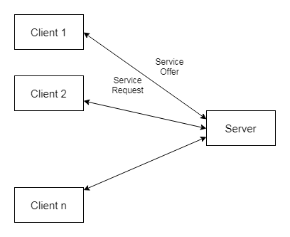
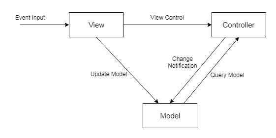
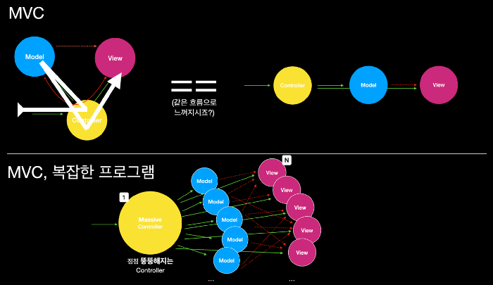

# 아키텍쳐 모델

## 클라이언트 -서버 패턴

- 클라이언트 : 서버에 서비스를 요청하는 객체
- 서버 : 클라이언트에 서비스를 제공하는 객체
- C-S 패턴은 다수의 클라이언트와 하나의 서버로 구성됩니다. 서버는 **클라이언트에 서비스를 제공하며 데이터를 관리하는 역할**을 합니다.

이메일, 문서 공유등 온라인 애플리케이션

일반적인 웹 프로그램

## MVC 패턴

- 모델 :
    - 어플리에키션이 '무엇'을 할 것인지, 내부 비지니스 로직을 처리
    - 도메인의 기능과 자료를 저장, 보관
- 뷰 :
    - 화면에 '무엇'인가를 '보여주기 위한 역할'
    - 사용자에게 결과를 표시(하나 이상 정의 가능)
- 컨트롤러 :
    - '어떻게' 처리할 지를 알려주는 역할
    - 사용자로부터 입력과 상호작용을 처리

각자의 역할을 갖고 사용자에게 서비스를 제공, 재사용성 증진

### MVC의 한계

다수의 Model과 View가 복잡하게 Controller에 연결

뷰와 모델이 서로 의존성을 띄게 된다

→ MVVM, 등등의 패턴이 파생