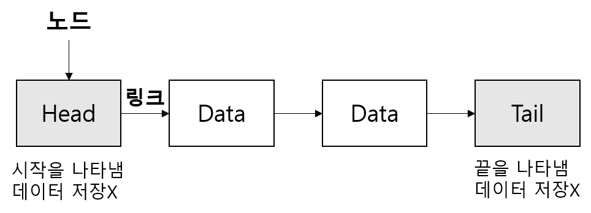

# 10주차 자료구조

> 자료구조란 자료에 효율적으로 접근하고 수정할 수 있도록 데이터를 구성하고 저장하는 방법

# Array

동일한 자료형의 데이터를 일렬로 나열한 자료구조

- 선형 자료구조
- 데이터 접근이 용이(인덱스로 접근)
- 데이터 삽입/삭제가 어렵다
- 구조가 간단하여 프로그램 작성이 쉽다.

### 시간 ,공간 복잡도

- 데이터 조회 : O(1) - 인덱스로 접근
- 데이터 삽입/삭제 : O(n) - 삭제 및 삽입 후 원소들을 이동

## Linked List

각 노드가 **데이터와 포인터**를 가지고 일렬로 연결되어 있는 방식

- 선형 자료구조
- 데이터의 접근이 느리다 (링크를 타고 가서 찾아야 된다)
- 데이터의 삽입/삭제 연산이 용이
- 포인터를 위한 추가 공간이 필요

### 시간 복잡도

- 데이터 조회 : O(n)
- 맨 앞/뒤에 데이터 삽입 삭제 : O(1)
- 중간의 원하는 위치에 데이터 삽입/ 삭제 : O(n)

[Array vs Linked List](https://www.notion.so/0a7c44c387314ef3bf0e85fc97d29c83)

- 메모리 할당
    - Array는 정적 메모리 (Complie time)
    - Linked List는 동적 메모리 할당 (Runtime)
    - Array의 경우 데이터 삽입 시 모든 공간이 다 차버렸다면 새로운 메모리 공간이 필요하지만 LinkedList는 동적으로 할당받을 수 있다.

## Stack

- 선형 자료구조
- 삽입 삭제 연산이 한 방향에서 이루어진다
- LIFO

### 시간 복잡도

- 데이터 삽입/삭제 : O(1)
- top 데이터 조회 : O(1)
- 특정 데이터 조회 : O(n)

### 활용

- 시스템 스택(System Stack) / 실행시간 스택(Runtime stack) : 프로그램의 함수 호출과 복귀에 따른 실행 순서 관리
- 인터럽트 루틴 처리
- 웹 브라우저 방문 기록 관리 (뒤로가기)
- 실행 취소 (undo)
- 수식의 후위 표기법(Postfix Notation)
- 수식의 괄호식 검사
- 계산기 검사
- 깊이 우선 탐색(DFS, Depth-First Search)

## Queue

- 선형 자료구조
- 한 방향에서는 삽입 연산이 , 반대 방향에서는 삭제 연산이 이루어진다.
- FIFO

### 시간 복잡도

- 데이터 삽입/삭제 : O(1)
- front 데이터 조회 : O(1)
- 특정 데이터 조회 : O(n)

### 활용

- 프로세스 레디 큐
- 스케쥴링
- 캐시(Cache) 구현
- 네트워크 패킷 전송시 필요한 버퍼 대기 큐
- javascript의 Event Loop 관리 (비동기 처리)
- 키보드 버퍼
- 프린터의 출력 처리
- 너비 우선 탐색(BFS, Breadth-First Search)

## Tree

자료들 사이의 계층적 관계를 나타내는데 사용하는 자료구조로 부모-자식 관계로 표현된다.

- 비선형 자료구조
- 트리는 다음의 조건을 만족한다.
  - 루트 노드(root node)가 존재한다. *(→ 트리는 반드시 1개 이상의 노드를 가진다.)*
  - 트리의 부분 트리(sub tree) 또한 트리 구조를 따른다.

## N링크 표현법

하나의 자료가 최대 N개의 자식을 가지게되는구조

### 시간복잡도

- 노드 삽입: O(1)
- 노드 삭제: O(1)
- 노드 검색: O(N)

## 왼쪽자식/오른쪽형제 표현법

왼쪽으로가면 자식을 오른쪽으로가면 형제노드 방문

구현이 쉽다.

### 시간복잡도

- 노드 삽입 : O(n)
- 노드 검색 : O(n)
- 노드 삭제 : O(1)

### 활용

- HTML DOM 트리
- 파일 시스템
- DBMS
- 검색 엔진
- 트라이 알고리즘

## Binary Tree(이진 트리)

트리의 차수가 2 이하인 트리이다.

- 비선형 자료구조
- 자식이 최대 2개이기 때문에 자식을 왼쪽 자식과 오른쪽 자식으로 구분한다.
- 높이가 `N`인 이진 트리의 최대 노드 개수는 2^n-1개 이다.

### 종류

- 포화 이진 트리 : 모든 외부 노드의 깊이가 같은 이진 트리
  - 높이가 H인 포화 이진 트리의 노드 개수는 2^h-1
  - 높이는 log2(N+1)
  - 깊이는 2^D
- 완전 이진 트리 : 마지막 레벨은 노드가 왼쪽에 물려 있고 마지막 레벨을 제외하면 포화이진 트리구조를 띄고 있는 이진트리

### 알고리즘

- 이진 탐색 트리

  - 조건
    - 모든 노드의 키는 유일하다. // 중복된 데이터를 갖는 노드가 없다는 뜻이다. 여기서 키의 의미는 노드 안에 들어 있는 데이터 값을 의미한다.
    - 왼쪽 서브 트리의 키들은 루트의 키보다 작다. // 예를 들어 루트노드의 데이터가 5라고 하면, 왼쪽 서브트리에는 무조건 5보다 작은 값들만 존재해야 한다.
    - 오른쪽 서브 트리의 키들은 루트의 키보다 크다. // 위와 같은 원리로 오른쪽에는 루트의 데이터 값보다 더 큰 값들만 존재한다.
    - 왼쪽과 오른쪽 서브 트리도 이진 탐색 트리이다. // 순환적으로 정의되었다는 뜻이다. 즉 왼쪽 서브트리로 내려가든, 오른쪽 서브트리로 내려가든 동일한 법칙이 적용된다는 뜻이다.
  - 시간복잡도
    - 탐색,삽입, 삭제연산은 트리 높이 H라고 했을때  O(log2(n))
      - 삭제 노드가 리프노드인 경우 → 바로 O(1)
      - 삭제할 노드가 자식이 하나만 있는 경우
      - 삭제할 노드에 자식이 둘 있는 경우→ 대체자 찾아서
  - 순회
    - 전위 순회(pre-order traversal)
    - 중위 순회(in-order traversal) : 정렬된 원소의 목록을 획득
    - 후위 순회(post-order traversal)

  BST의 검색에 대한 시간복잡도는 균형 상태이면 O(logN)의 시간이 걸리고 불균형 상태라면 최대 O(N) 시간이 걸립니다.

## Graph